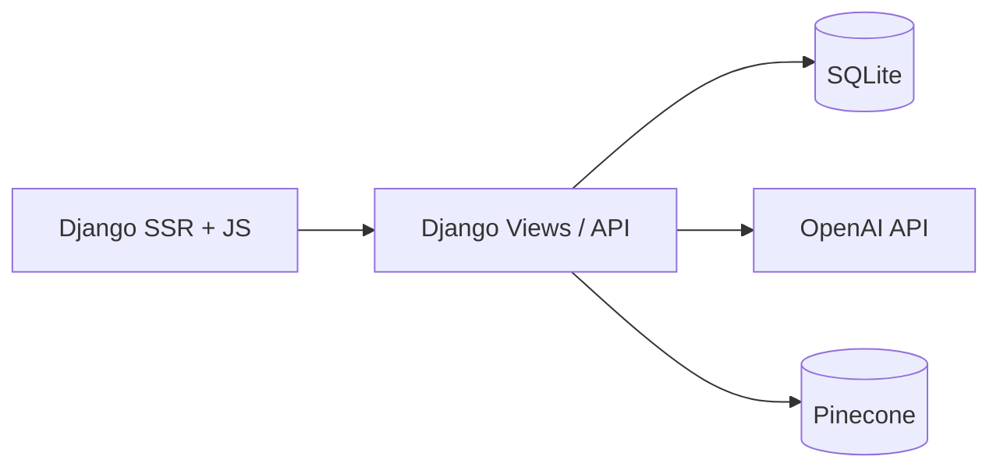

# LG Home — LG 가전 AI 추천·상담 서비스

> SKN26 4th Project · Django 기반 가전 검색 + LangGraph 챗봇(LGneer) + 사용설명서 RAG

---

## 👥 Team
<table>
  <tr>
    <td align="center">
      <br />
      <b>박기은</b><br />
    </td>
    <td align="center">
      <br />
      <b>서민혁</b><br />
    </td>
    <td align="center">
      <br />
      <b>유동현</b><br />
    </td>
    <td align="center">
      <br />
      <b>윤정연</b><br />
    </td>
    <td align="center">
      <br />
      <b>이레</b><br />
    </td>
    <td align="center">
      <br />
      <b>정영일</b><br />
    </td>
  </tr>
  <tr>
    <td align="center"><b>Role</b><br>Frontend</td>
    <td align="center"><b>Role</b><br>Frontend</td>
    <td align="center"><b>Role</b><br>Backend</td>
    <td align="center"><b>Role</b><br>Modeling</td>
    <td align="center"><b>Role</b><br>Database</td>
    <td align="center"><b>Role</b><br>Modeling</td>
  </tr>
  <tr>
    <td align="center"><a href="https://github.com/gieun-Park"></a></td>
    <td align="center"><a href="https://github.com/minhyeok328"></a></td>
    <td align="center"><a href="https://github.com/Ocean-2930"></a></td>
    <td align="center"><a href="https://github.com/dimolto3"></a></td>
    <td align="center"><a href="https://github.com/leere2424"></a></td>
    <td align="center"><a href="https://github.com/wjdduddlf112"></a></td>
  </tr>

</table>

---

## 1. Overview

### 1.1 소개

**LG Home**은 LG 가전(TV, 냉장고, 세탁기, 에어컨, 청소기)을 대상으로 한 **통합 검색·추천 웹 서비스**입니다.

사용자는 두 가지 방식으로 제품을 탐색할 수 있습니다.

1. **필터 검색 UI** — 카테고리·가격·스펙 조건을 선택해 상품 목록을 조회
2. **LG봇(LGneer)** — 「100만 원 이하 500L 냉장고」「세탁기 UE 에러가 뭐야?」처럼 **자연어**로 질의하면, AI가 조건을 구조화해 DB·매뉴얼을 검색하고 답변

챗봇은 **LangGraph**로 여러 단계(범위 판별, 제품군 분류, 의도·슬롯 추출, DB/RAG 검색, 답변 생성)를 거치며, 사용설명서 Q&A는 **Pinecone 벡터 검색(RAG)**을 활용합니다.

### 1.2 문제 정의

- 가전 구매 시 **스펙 항목이 많고** 카테고리마다 비교 기준이 달라, 원하는 조건을 찾기 어렵다.
- 사용설명서·고객지원 정보는 **분산**되어 있어, 기능 사용법·오류 코드를 빠르게 확인하기 어렵다.
- 기존 쇼핑몰 검색은 **키워드·필터 중심**이라, 「우리 집에 맞는」「전기세 적게 쓰는」 같은 **맥락 있는 질문**에 약하다.

### 1.3 목표

- LG 가전 5개 카테고리에 대한 **구조화된 상품 DB** 구축 및 조건 검색 제공
- 자연어 → **검색 슬롯 자동 추출** → ORM 기반 상품 추천
- 사용설명서 **RAG**로 사용법·오류 해결 Q&A 지원
- **찜(관심 제품)** 범위 내 검색·상담 등 개인화 맥락 반영
- Django SSR + Tailwind로 **실사용 가능한 웹 UI** 제공

---

## 2. Features

| 구분 | 기능 | 설명 |
|------|------|------|
| 메인 | 카테고리 탐색 | TV·세탁기·냉장고·에어컨·청소기 바로가기 |
| 검색 | 필터 검색 | 카테고리별 스펙 필터, 가격 범위, 페이지네이션(12건/페이지) |
| 상품 | 상세 페이지 | 이미지·가격·스펙·매뉴얼 링크, 찜하기 |
| 채팅 | LG봇 | LangGraph 기반 대화, 대화방·히스토리, 추천 질문 |
| 계정 | 회원가입·로그인 | 닉네임·프로필 사진, 마이페이지 |
| 개인화 | 찜 목록 | 관심 제품 저장·해제, 챗봇 `from_favorites` 검색 |
| AI | fall case 처리 | 전자제품 상담 범위 밖 질문 정중 거절 |
| AI | 후속 질문 | 이전 검색 맥락을 활용한 연속 대화 |

---

## 3. Tech Stack

| 레이어 | 기술 |
|---|---|
| **Language** | Python 3.12+ |
| **Web Framework** | Django 6.0 |
| **Frontend** | Django Templates (SSR), Tailwind CSS v4, django-tailwind, 바닐라 JS |
| **LLM** | OpenAI `gpt-4o-mini` |
| **Embedding** | OpenAI `text-embedding-3-small` |
| **Orchestration** | LangGraph, LangChain Core |
| **Vector DB** | Pinecone (`user_manual` namespace) |
| **Database** | SQLite (개발), Django ORM |
| **Data Pipeline** | Selenium, BeautifulSoup, Jupyter(notebook) |
| **Config** | python-dotenv (`.env`) |

---

## 4. Directory Structure

```
4th_project/
├── config/                 # Django settings, urls, wsgi, asgi
├── accounts/               # 회원·찜(UserFavorite)
├── products/               # 상품 모델·검색 뷰·크롤링 데이터
│   └── data/raw/data_crawling/   # 카테고리별 CSV·크롤링 스크립트
├── chats/                  # 채팅방·메시지 모델·채팅 페이지
├── api/                    # send_chat 등 REST API
├── common/                 # LangGraph(llm.py), 에이전트(llm_agent.py), 벡터 검색
├── mainpage/               # 메인 페이지
├── templates/              # 페이지·컴포넌트 HTML
├── static/                 # JS, CSS, 이미지, 필터 JSON
├── theme/                  # Tailwind 빌드 (django-tailwind)
├── docs/                   # 파트별·기능별 위키 (docs/README.md)
├── manage.py
├── requirements.txt
└── README.md
```

---

## 5. Data Pipeline

### 5.1 수집

- **대상**: LG전자 공식몰 가전 카테고리 (TV, 에어컨, 냉장고, 청소기, 세탁기)
- **방식**: `products/data/raw/data_crawling/` — Selenium + BeautifulSoup 기반 크롤링
- **산출물**: 카테고리별 `*_all_products.csv`, 상품 링크·HTML 스냅샷

### 5.2 전처리

- Notebook(`*_db.ipynb`, `loaddata.ipynb`)으로 CSV 정제 후 Django 모델 스키마에 맞게 적재
- 제품 코드 prefix로 카테고리 구분 (`TVT`, `ACT`, `REF`, `VAC`, `WMT`)

### 5.3 저장

| 저장소 | 내용 |
|--------|------|
| **SQLite** | `ProductTV`, `ProductFridge`, `ProductWash`, `ProductAC`, `ProductVAC` 등 |
| **Pinecone** | 사용설명서 청크(메타: `product_code`, `page_number`, `product_code_header`) |

### 5.4 활용 (Runtime)

```
사용자 질의
  → fall_case 판별 (범위 밖이면 종료)
  → 후속 질문 / 제품군 분류 (TVT·ACT·REF·VAC·WMT)
  → intent_router (카테고리별 슬롯 추출 + vector_search 쿼리)
  → db_search (ORM 조건 검색, 찜 범위 옵션)
  → [결과 있음] answer_with_result (DB + 매뉴얼 RAG 근거 답변)
  → [결과 없음] answer_without_result / reverse_condition
```

### 5.5 시스템 및 LLM 아키텍처

#### 시스템 아키텍처



#### LLM 아키텍처 (LangGraph)

| 노드 | 역할 |
|------|------|
| `fall_case_node` | 상담 범위 밖 질문 거절 |
| `subsequence_router` | 후속 질문 여부 판별 |
| `product_classification` | TV/에어컨/냉장고/청소기/세탁기 분류 |
| `intent_router` | 자연어 → 검색 슬롯(structured output) |
| `db_search` | ORM 상품 검색 |
| `answer_with_result` | DB + 매뉴얼 RAG 기반 최종 답변 |
| `answer_without_result` | 검색 실패 안내 |

구현: `common/llm.py`, 프롬프트·구조화 출력: `common/llm_agent.py`, 벡터 검색: `common/vector_search.py`

---

## 6. Database Schema

### 엔티티 테이블 (상품)

| Table | 카테고리 | 주요 컬럼 |
|---|---|---|
| `ProductTV` | TV | `product_code`, `name`, `price`, `screen_size`, `display_type`, `manual_link` |
| `ProductFridge` | 냉장고 | `total_cap`, `door_cnt`, `smart_diag`, `ice_maker`, … |
| `ProductWash` | 세탁기 | `washing_cap`, `drying_cap`, `door_design`, … |
| `ProductAC` | 에어컨 | `cool_cap`, `coverage`, `color`, … |
| `ProductVAC` | 청소기 | `suction_power`, `battery_cnt`, … |

### 관계·계정 테이블

| Table | 의미 |
|---|---|
| `accounts_account` | 사용자(닉네임, 프로필 사진) |
| `accounts_userfavorite` | 찜 — `product_code` |
| `chats_chatroom` | 대화방, `agent_state`(JSON) |
| `chats_singlechat` | 메시지(`is_userchat`, `content`) |

### ERD (개요)

```
Account 1──N UserFavorite
Account 1──N Chatroom 1──N SingleChat
Product* (카테고리별 독립 테이블, product_code PK)
```

---

## 7. Installation

### 7.1 사전 요구사항

- Python 3.12+
- Node.js / npm (Tailwind 빌드)
- OpenAI API Key, Pinecone API Key & Host
- (크롤링만 할 경우) Chrome + Selenium WebDriver

### 7.2 설치 절차 (Windows / PowerShell 기준)

```powershell
cd 4th_project
python -m venv .venv
.\.venv\Scripts\Activate.ps1
pip install -r requirements.txt

cd theme\static_src
npm install
npm run build
cd ..\..

python manage.py migrate
# 상품 데이터 적재: products/loaddata.ipynb 또는 팀 제공 db.sqlite3 사용
python manage.py runserver
```

> 스타일 개발 시 `theme/static_src`에서 `npm run dev`를 별도 터미널에서 실행합니다.

### 7.3 환경변수 설정

프로젝트 루트에 `.env` 파일을 생성합니다.

```env
OPENAI_API_KEY=sk-...
PINECONE_API_KEY=...
PINECONE_HOST=...
```

`config/settings.py`에서 `load_dotenv()`로 로드됩니다.

### 7.4 데이터베이스

```powershell
python manage.py migrate
# 초기 상품 데이터는 팀 내부 절차(노트북 적재 또는 db.sqlite3)에 따름
```

---

## 8. Usage

### 8.1 웹 앱 실행 (권장)

```powershell
python manage.py runserver
```

브라우저에서 `http://127.0.0.1:8000/` 접속

| 경로 | 설명 |
|------|------|
| `/` | 메인 · LG봇 CTA |
| `/products/` | 필터 검색 |
| `/products/<code>/` | 상품 상세 |
| `/chats/` | LG봇 (로그인 필요) |
| `/accounts/` | 로그인 |
| `/accounts/mypage/` | 마이페이지·찜 |

### 8.2 API — 채팅 전송

```http
POST /api/send_chat/
Content-Type: application/json

{
  "chat_id": null,
  "user_input": "500L 이상 냉장고 추천해줘"
}
```

성공 응답: `response`, `response_tail`, `chat_id`, `chatroom_name`

오류 응답:
- `401` (비로그인), `400` (JSON/입력 오류), `405` (POST 외 메서드)

### 8.3 Python — LangGraph 직접 호출

채팅방·DB 컨텍스트 없이 그래프만 검증할 때는 `common/llm.py`의 `graph_instance` 또는 `debug.py`를 참고합니다.

### 8.4 RAG · 벡터DB 연동

- **임베딩**: `text-embedding-3-small`
- **검색**: `common/vector_search.py` → Pinecone `user_manual` namespace, `product_code_header` 필터
- **활용**: `intent_router`의 `vector_search` 슬롯 → `db_search` 이후 `answer_with_result`에서 매뉴얼 근거 인용

---

## 9. Example

**제품 검색**

| 입력 | 기대 동작 |
|------|-----------|
| 「100만 원 이하 55인치 TV」 | `product_type=TVT`, `price_lte`, `screen_size` 등 슬롯 추출 후 목록 응답 |
| 「찜한 제품 중 에너지 1등급 냉장고」 | `from_favorites=True`, REF 카테고리 DB 검색 |

**사용설명서 Q&A**

| 입력 | 기대 동작 |
|------|-----------|
| 「세탁기 UE 에러가 뭐야?」 | WMT 분류 → 매뉴얼 RAG → 에러 설명 + 출처 페이지 |
| 「에어컨 필터 청소 방법」 | ACT + vector_search → 매뉴얼 단계 안내 |

**범위 밖**

| 입력 | 기대 동작 |
|------|-----------|
| 「오늘 날씨 어때?」 | fall case — 전자제품 상담 범위 안내 후 종료 |

---

## 10. Evaluation Results


### 10.1 평가 설정
- fall_case_node의 is_fall_case True, False 판정 확인
- subsequence_router_node의 is_subsequence True, False 판정 확인
- product_classification_node의 분류 정확도 확인


### 10.2 차수별 핵심 성능 비교

- fall_case_node Confusion Matrix

|                | Predicted Positive | Predicted Negative |
|----------------|-------------------|-------------------|
| Actual Positive | 24 | 1 |
| Actual Negative | 3 | 22 |

- fall_case_node Metrics

| Metric | Score |
|--------|--------|
| Accuracy | 0.9200 |
| Precision | 0.8889 |
| Recall | 0.9600 |
| F1 Score | 0.9231 |

- subsequence_router_node Confusion Matrix

|                | Predicted Positive | Predicted Negative |
|----------------|-------------------|-------------------|
| Actual Positive | 25 | 0 |
| Actual Negative | 0 | 25 |

- subsequence_router_node Metrics

| Metric | Score |
|--------|--------|
| Accuracy | 1.0000 |
| Precision | 1.0000 |
| Recall | 1.0000 |
| F1 Score | 1.0000 |

- product_classification_node Prediction Results

| Index | 사용자의 질문 | 정답 라벨 | predict_label | is_correct |
|------|-----------------------------|-----------|---------------|------------|
| 0 | TV 화면이 너무 어두워 | TVT | TVT | True |
| 1 | 티비 리모컨 연결 방법 알려줘 | TVT | TVT | True |
| 2 | 에어컨 자동 청소 기능 어떻게 써? | ACT | ACT | True |
| 3 | 제습 잘 되는 에어컨 찾아줘 | ACT | ACT | True |
| 4 | 냉장고 필터 교체 방법 알려줘 | REF | REF | True |
| 5 | 김치냉장고 추천해줘 | REF | REF | True |
| 6 | 흡입력 좋은 청소기 찾아줘 | VAC | VAC | True |
| 7 | 로봇청소기 물걸레 기능 있어? | VAC | VAC | True |
| 8 | 세탁기 UE 에러가 뭐야? | WMT | WMT | True |
| 9 | 건조 기능 있는 세탁기 찾아줘 | WMT | WMT | True |
| 10 | 안녕 |  |  | True |
| 11 | 오늘 날씨 어때? |  |  | True |
| 12 | 전자레인지 추천해줘 |  |  | True |
| 13 | 노트북 찾아줘 |  |  | True |
| 14 | 공기청정기 필터 교체 방법 알려줘 |  |  | True |
| 15 | 그중에 제일 싼 거 |  |  | True |
| 16 | 두 번째 거 설명해줘 |  |  | True |
| 17 | 삼성 거 추천해줘 |  |  | True |
| 18 | LG 제품 찾아줘 |  |  | True |
| 19 | 건조기 추천해줘 |  |  | True |

- product_classification_node Accuracy
Accuracy: **100.00%**


### 10.3 질의 유형별 비교
3개의 분기 node모두 단순한 작업 단위로 나누어 llm요청을 보냈기 때문에
분기, 분류에 있어 높은 정확도를 확인할 수 있었다.


### 10.4 차수별 실패 패턴과 보완 포인트
- fall_case_node의 경우 아래의 test case가 예측이 실패했다

- 정답 라벨에서 fall_case가 False로 제시되어 있는 아래 질문들에 llm은 fall_case True를 판정했다.
비교해줘 > 어떤 전자제품을 비교해드릴까요? 제품명이나 종류를 알려주시면 도움을 드리겠습니다.
안녕 > 안녕하세요! 전자제품에 대한 질문이 있으시면 도와드릴게요.
질문해도 돼? > 전자제품에 대한 질문이 있으시면 말씀해 주세요!
>> 위의 질문들은 간단한 사교성/혹은 바로 답변할 수 있는 질문들로 fall_case True라고 할 수 있다.

- 정답 라벨에서 fall_case가 True로 제시되어 있는 아래 질문에 llm은 fall_case False를 판정했다.
이 TV 바로 구매해줘
>> 위의 질문은 TV의 구매라는 llm의 역할 범위 외의 질문이었지만 TV가 내용에 포함되어 있어 fall_case 판정에 실패했다.

### 10.5 무엇을 추가로 보완해야 하는가
- llm prompt의 허점을 확인하기 위해서 더 많은 테스트 케이스의 확인
- 더 많은 사용자 요청에 답변할 수 있게끔 langgraph node 구조의 고도화
- intent_router_node에 대해서도 추가로 슬롯 추출 정확도 테스트
- 확인한 제품 정보를 활용해서 더 다양한 답변을 생성할 수 있도록 프롬프트 최적화


### 10.6 재현 방법
llm 테스트는 아래의 파일의 코드를 통해 수행하였음
common/llm_frame.ipynb


---

## 11. Limitations

1. **데이터 범위**: LG 가전 5개 카테고리·공식몰 크롤링 데이터에 한정
2. **비로그인 찜**: 일부 UI에서 로그인 가드가 약함
3. **비밀번호 찾기·결제**: UI만 존재, 서버 미연동
4. **리뷰/Q&A 탭**: 상품 상세 일부 목업 데이터
5. **LLM 환각**: 검색 결과 없을 때 안내하지만, 프롬프트·평가로 지속 보완 필요

---

## 12. Future Work

- [ ] 평가 세트·자동 채점 파이프라인 정리
- [ ] 비로그인 UX(찜·채팅) 일관성 개선
- [ ] 비밀번호 재설정·이메일 인증
- [ ] 배포 환경(PostgreSQL, 정적 파일 CDN) 구성
- [ ] 카테고리·브랜드 확장 검토

---
## 13. Service Expansion & Business Model

- **B2C**: 가전 구매 전 단계의 AI 상담·비교 도구로 파트너몰·제조사 채널 연동 가능
- **B2B**: 콜센터·매뉴얼 검색 보조, 사내 지식 RAG 확장
- **수익 모델(안)**: 제휴 링크·프리미엄 필터·기업용 API — 구체화 예정

---

## 14. Output
- **요구사항 정의서**: _(링크 추가)_
- **기술 문서 (Docs 위키)**: [`docs/README.md`](docs/README.md) — 파트별·기능별 문서 허브
- **화면설계서**: [`docs/03-frontend/frontend.md`](docs/03-frontend/frontend.md) (프론트 위키·체크리스트)
- **개발된 LLM 연동 애플리케이션**: 본 저장소 (`/chats/`, `common/`)
- **시스템 구성도**: README §5.5 · 상세 [`docs/02-architecture/system-architecture.md`](docs/02-architecture/system-architecture.md)
- **API / DB 문서**: [`docs/06-api/rest-api.md`](docs/06-api/rest-api.md) · [`docs/05-database/schema-and-erd.md`](docs/05-database/schema-and-erd.md)
- **테스트 계획 및 결과보고서**: README §10 (정리 완료, 추가 자동평가 파이프라인 보완 예정)

---

## 15. 프로젝트 회고

### 개인 회고
<table style="width: 100%; border-collapse: collapse; border: 1px solid #ddd;">
    <thead>
        <tr style="background-color: #f8f9fa;">
            <th style="width: 20%; border: 1px solid #ddd; padding: 10px;">이름</th>
            <th style="border: 1px solid #ddd; padding: 10px;">회고</th>
        </tr>
    </thead>
    <tbody>
        <tr>
            <td style="text-align: center; border: 1px solid #ddd;">박기은</td>
            <td style="border: 1px solid #ddd; padding: 10px;">이번 프로젝트는 AI 기반 전자제품 검색 시스템으로, 프론트엔드 개발을 담당하며 단순히 화면을 구현하는 것에서 끝나는 것이 아니라 사용자가 서비스를 이용할 때 어떤 흐름으로 화면을 보게 되는지까지 고려하며 진행했다.
프로젝트 초반에는 먼저 피그마를 활용해 화면 목업 디자인으로 메인 페이지, 검색 화면, 상세 페이지, 챗봇 화면 등 전체 서비스 흐름을 먼저 설계하면서 사용자 동선을 고민했다. 이 과정에서 단순히 예쁜 디자인보다 정보가 잘 정리되어 보이는 구조와 사용하기 편한 UI가 더 중요하다는 점을 느꼈다. 버튼 위치, 카드 크기, 색상 구성, 카테고리 배치 등을 여러 번 수정하며 사용자 입장에서 직관적으로 보일 수 있도록 디자인을 개선했다.
이후에는 HTML, CSS, JavaScript 기반으로 프론트엔드 개발을 진행했고, Tailwind CSS를 활용해 UI를 구현했다. 처음에는 Tailwind CSS의 클래스 기반 스타일링 방식이 익숙하지 않았지만, 사용하다 보니 빠르게 스타일을 수정하고 일관된 디자인을 유지할 수 있다는 장점을 체감할 수 있었다.
프로젝트 진행 과정에서는 개발 환경 충돌 문제도 경험했다. Tailwind CSS와 Django를 연결하는 과정에서 패키지 실행 오류와 경로 충돌 문제가 발생했고, Node 설정이 제대로 인식되지 않아 개발 환경이 정상적으로 실행되지 않는 상황도 있었다. 처음에는 단순 코드 오류라고 생각했지만, 문제 원인을 추적하며 패키지 구조와 실행 환경 설정을 점검하는 과정을 통해 단순히 기능 구현만이 아니라 개발 환경을 이해하고 설정하는 과정 또한 개발에서 중요한 부분이라는 점을 배울 수 있었다.
초기 설계 과정부터 Tailwind CSS 기반 UI 구현, Django 연동까지 전반적인 프론트엔드 개발 과정을 경험하면서 실무적인 개발 흐름을 이해할 수 있었고, 앞으로도 사용자 경험을 고려하는 개발자가 되고 싶다는 목표를 갖게 되었다.</td>
        </tr>
        <tr>
            <td style="text-align: center; border: 1px solid #ddd;">서민혁</td>
            <td style="border: 1px solid #ddd; padding: 10px;">이번 프로젝트에서는 AI 기반 전자제품 검색 시스템의 프론트엔드 개발을 담당하며, 단순한 화면 구현을 넘어 사용자 경험과 서비스 흐름을 고려한 개발을 진행하고자 노력했다. 프로젝트 초기에는 Figma를 활용해 메인 페이지, 검색 페이지, 상품 상세 페이지, 챗봇 페이지 등 전체 서비스 화면 구조를 설계하며 사용자 동선과 인터페이스 흐름을 먼저 고민했다. 단순히 화면을 예쁘게 만드는 것보다 사용자가 필요한 정보를 직관적으로 확인할 수 있도록 구성하는 데 집중했고, 실제 구현 단계에서도 이러한 흐름이 유지될 수 있도록 지속적으로 수정·개선하였다.
<br>
특히 프로젝트 진행 중에는 Tailwind CSS와 Django 환경 연동 과정에서 여러 개발 환경 문제를 경험하였다. 패키지 충돌, Node 실행 오류, 경로 설정 문제 등 예상하지 못한 환경 이슈가 반복적으로 발생했지만, 단순히 오류를 해결하는 데 그치지 않고 실행 구조와 설정 방식을 직접 분석하며 문제 원인을 파악하고자 했다. 이를 통해 실제 개발에서는 기능 구현만큼 개발 환경을 이해하고 유지하는 과정 역시 중요하다는 점을 체감할 수 있었다.
<br>
또한 Git 브랜치 관리와 협업 과정에서도 팀원들과 지속적으로 소통하며 충돌을 최소화하고 작업 구조를 정리하는 역할을 수행하였다. 프론트엔드 구조와 static 자산, 템플릿 구조 등을 정리하면서 이후 유지보수성과 협업 효율성을 고려한 개발 방식에 대해 고민할 수 있었던 점도 의미 있는 경험이었다.
<br>
이번 프로젝트를 통해 UI 구현 능력뿐 아니라 사용자 경험, 협업 구조, 프론트-백엔드 연동, 개발 환경 설정까지 포함한 전체적인 웹 서비스 개발 흐름을 경험할 수 있었고, 앞으로도 사용자 입장에서 고민하며 서비스 완성도를 높일 수 있는 개발자가 되고 싶다는 목표를 갖게 되었다.</td>
        </tr>
        <tr>
            <td style="text-align: center; border: 1px solid #ddd;">유동현</td>
            <td style="border: 1px solid #ddd; padding: 10px;">이번 프로젝트에서는 Django Framework를 활용하여 페이지 라우팅, API 엔드포인트 개발 및 Model DB 구축을 담당하며 백엔드 전반의 기반 시스템을 구현하였다. 아예 처음 들어보는 django를 접해 직접 학습하고 구현하는 과정이 필요했는데 학습과 개발이 동시에 병행되어 더 UX에 최적화를 위한 방향으로 아키텍처를 수정하고 변경하는 일이 많았었다. 이와 함께 LLM과 데이터베이스, pinecone 작업도 직간접적으로 기여하는 과정에서 얻은 각 분야의 체계적인 개발 경험을 바탕으로 최종 프로젝트를 준비해보고자 한다.</td>
        </tr>
        <tr>
            <td style="text-align: center; border: 1px solid #ddd;">윤정연</td>
            <td style="border: 1px solid #ddd; padding: 10px;">이번 프로젝트에서 비정형 데이터인 가전제품 설명서 PDF로부터 텍스트를 추출하고, 검색 효율성을 고려한 문맥 기반의 청킹 전처리 작업을 수행했습니다. 이후 OpenAI 임베딩 모델을 활용해 데이터를 벡터화한 뒤 Pinecone DB 환경에 맞춘 메타데이터 설계 및 적재, 그리고 자연어 질의 기반의 검색 검증까지 완수하였습니다. 전체적인 데이터의 흐름을 깊이 이해할 수 있었고, 이러한 경험을 바탕으로 다음 프로젝트에서는 DB 파트를 넘어 실제 AI 모델링 아키텍처까지 직접 다뤄보고 싶다는 새로운 목표를 갖게 되었습니다.</td>
        </tr>
        <tr>
            <td style="text-align: center; border: 1px solid #ddd;">이레</td>
            <td style="border: 1px solid #ddd; padding: 10px;">이번 프로젝트에서는 데이터 파트를 담당하며 제품 데이터 크롤링, 컬럼 라벨링, 데이터 타입 통일 및 전처리 작업을 진행하였습니다. 제품별로 서로 다른 스펙 구조를 하나의 형태로 정리해야 했기 때문에 컬럼명을 통일하고 타입을 맞추는 과정에 특히 신경을 많이 썼습니다. 이를 통해 데이터 정합성과 전처리 과정이 이후 검색 및 Q&A 품질에 큰 영향을 준다는 점을 체감할 수 있었습니다.
<br>
또한 제품별 HTML 구조가 조금씩 달라 예외 처리가 필요한 경우가 많았는데, 반복적으로 테스트하며 안정적으로 데이터를 수집할 수 있도록 개선하였습니다. 단순히 데이터를 수집하는 것을 넘어 실제 서비스에서 활용 가능한 형태로 데이터를 구성하는 경험을 할 수 있었습니다.
<br>
프로젝트 진행 중 팀원 간 의견 충돌이 있었던 순간도 있었지만, 서로의 상황과 의도를 충분히 설명하고 이해하려고 노력하면서 더 효율적인 방향으로 프로젝트를 진행할 수 있다는 점을 배우게 되었습니다. 이번 프로젝트를 통해 데이터 처리 역량뿐만 아니라 협업 과정에서의 소통의 중요성도 함께 느낄 수 있었습니다.</td>
        </tr>
        <tr>
            <td style="text-align: center; border: 1px solid #ddd;">정영일</td>
            <td style="border: 1px solid #ddd; padding: 10px;">LLM 챗봇의 대화 흐름 설계와 분기 구조를 책임졌다. 사용자의 질문이 일반 대화인지, 제품 검색 요청인지, 이전 검색 결과에 이어지는 후속 질문인지 구분하는 흐름을 설계하고, 상황에 따라 적절한 처리 단계로 이동할 수 있도록 구조화하였다. 또한 각 대화 단계에서 어떤 정보를 판단하고 어떤 답변으로 이어져야 하는지 정리하여 챗봇의 전체 작동 방식을 구체화하였다. 이를 통해 LLM이 단순히 답변을 생성하는 수준을 넘어, 서비스 목적에 맞게 질문을 분류하고 검색·응답으로 연결될 수 있는 기반을 마련하였다.</td>
        </tr>
    </tbody>
</table>


---

### 팀원 회고

<table style="width: 100%; border-collapse: collapse; border: 1px solid #ddd; margin-bottom: 30px;">
    <thead>
        <tr style="background-color: #f8f9fa;">
            <th style="width: 15%; border: 1px solid #ddd; padding: 10px;">대상자</th>
            <th style="width: 15%; border: 1px solid #ddd; padding: 10px;">작성자</th>
            <th style="border: 1px solid #ddd; padding: 10px;">회고 내용</th>
        </tr>
    </thead>
    <tbody>
        <tr>
            <td rowspan="5" style="text-align: center; font-weight: bold; border: 1px solid #ddd;">박기은</td>
            <td style="text-align: center; border: 1px solid #ddd;">서민혁</td>
            <td style="border: 1px solid #ddd; padding: 10px;">프로젝트 초기 Figma 기반 화면 설계와 UI 구조 정리를 담당하며 전체 프론트엔드 방향성을 체계적으로 정리해주셨다. 메인 페이지, 검색 페이지, 상세 페이지, 챗봇 화면 등 주요 화면 흐름을 사용자 입장에서 고민하며 설계했고, 이를 기반으로 실제 구현 과정에서도 화면 일관성과 사용자 경험을 유지할 수 있도록 많은 도움을 주셨다.
<br>
또한 Notion 기반 문서화와 일정 관리까지 꼼꼼하게 정리해주셔서 팀 협업 과정이 훨씬 원활하게 진행될 수 있었다. 디자인과 문서화 모두에서 단순히 결과만 만드는 것이 아니라 협업 효율성과 사용자 흐름까지 함께 고려하는 모습이 인상 깊었다.</td>
        </tr>
        <tr>
            <td style="text-align: center; border: 1px solid #ddd;">유동현</td>
            <td style="border: 1px solid #ddd; padding: 10px;">Front 작업팀으로서 Figma 화면 설계서를 작업하여 계획적으로 사용자 UI 개발 과정을 수행하였음. 프로젝트 초기 단계에서 사용자 흐름과 화면 구성을 체계적으로 설계하여 이후 프론트엔드 개발이 원활하게 진행될 수 있도록 기반을 마련하였으며, 디자인 일관성과 사용자 경험을 고려한 UI 구조를 설계함. 또한 메인 페이지 및 개별 상품 페이지 등을 구현하며 사용자 친화적인 UI/UX 구성에 기여하였고, 실제 사용자가 서비스를 이용하는 흐름을 고려하여 세부적인 디자인 요소까지 지속적으로 개선하려는 노력을 보여주었음. 팀원들과 디자인 방향을 적극적으로 공유하며 프로젝트 전체 화면 구성의 완성도를 높이는 데 기여하였음.</td>
        </tr>
        <tr>
            <td style="text-align: center; border: 1px solid #ddd;">윤정연</td>
            <td style="border: 1px solid #ddd; padding: 10px;">매번 늦은 시간까지 남아서 프론트 개발에 온 힘을 쏟아주셨습니다. 피그마로 UI 디자인을 정교하게 설계한 뒤, HTML, 자바스크립트(JS), Tailwind CSS만을 활용해 페이지 이동 없는 탭 전환과 검색 필터 유지, 가격 콤마 및 품절 표시 같은 디테일한 화면을 완성하셨습니다.또한 노션(Notion)을 통해 전체 프로젝트 일정과 문서를 꼼꼼히 정리하며 팀의 협업 완성도를 끌어올려 주셨습니다.</td>
        </tr>
        <tr>
            <td style="text-align: center; border: 1px solid #ddd;">이레</td>
            <td style="border: 1px solid #ddd; padding: 10px;">노션 페이지 관리와 프론트 구현을 담당하시며 프로젝트 진행 상황과 작업 내용을 체계적으로 정리해주셨습니다. 회의 내용과 진행 현황을 보기 쉽게 정리해주셔서 팀원들이 현재 상황을 빠르게 파악할 수 있었고, 협업 과정에서도 많은 도움이 되었습니다. 또한 프론트 구현 과정에서도 맡은 역할을 성실하게 수행하시며 프로젝트 완성도 향상에 기여해주셨습니다. 특히 디자인 일관성과 사용자 경험을 고려한 UI 구조를 설계해주셨으며, 같은 파트를 맡은 팀원과 지속적으로 소통하며 프로젝트를 안정적으로 마무리할 수 있도록 기여해주셨습니다.</td>
        </tr>
        <tr>
            <td style="text-align: center; border: 1px solid #ddd;">정영일</td>
            <td style="border: 1px solid #ddd; padding: 10px;">주요 화면 UI 구현과 화면설계서 정리에 기여하였다. 메인, 검색, 상품 상세, 인증, 마이페이지, 챗봇 페이지의 UI 골격을 구성하고, Tailwind CSS 기반으로 전체 화면 톤을 통일하였다. 또한 화면설계서 담당자로서 페이지별 기능, 이동 플로우, 주요 컴포넌트, 사용자 동선을 정리하고, URL 설계, 로그인 권한, 페이지별 데이터, 공통 컴포넌트, 예외 상황 UI까지 추가할 방향을 제시하였다. 화면 구현과 문서화를 연결해 개발 기준을 명확히 한 점이 강점이다.</td>
        </tr>
    </tbody>
</table>
<table style="width: 100%; border-collapse: collapse; border: 1px solid #ddd; margin-bottom: 30px;">
    <thead>
        <tr style="background-color: #f8f9fa;">
            <th style="width: 15%; border: 1px solid #ddd; padding: 10px;">대상자</th>
            <th style="width: 15%; border: 1px solid #ddd; padding: 10px;">작성자</th>
            <th style="border: 1px solid #ddd; padding: 10px;">회고 내용</th>
        </tr>
    </thead>
    <tbody>
        <tr>
            <td rowspan="5" style="text-align: center; font-weight: bold; border: 1px solid #ddd;">서민혁</td>
            <td style="text-align: center; border: 1px solid #ddd;">박기은</td>
            <td style="border: 1px solid #ddd; padding: 10px;">화면 구현 속도가 빠르고 구조를 안정적으로 설계하는 능력이 뛰어나서 프로젝트 진행 과정에서 많은 도움을 받을 수 있었다. UI 구성이나 기능 연결 부분에서 먼저 전체 흐름을 정리해주거나 방향성을 제안해주었고, 덕분에 작업을 보다 효율적으로 진행할 수 있었다.<br>
또한 단순히 자신의 파트만 구현하는 것이 아니라 전체 서비스 흐름을 고려하며 개발을 진행하는 모습이 인상적이었다. 화면 간 연결 구조나 사용자 동선을 세심하게 확인하며 수정하는 과정에서 프론트엔드 개발은 단순한 디자인 구현이 아니라 사용자 경험까지 함께 고민해야 한다는 점을 배울 수 있었다.<br>
프로젝트를 진행하면서 환경 설정이나 오류 해결 과정에서도 많은 도움을 받았다.<br>
개발 환경 충돌이나 실행 오류가 발생했을 때 문제 원인을 함께 분석하고 해결 방향을 빠르게 찾아가는 모습을 보며 문제 해결 접근 방식에 대해서도 배울 수 있었다. 특히 오류가 발생했을 때 단순히 결과만 수정하는 것이 아니라 원인을 먼저 파악하려는 태도가 인상 깊었다.</td>
        </tr>
        <tr>
            <td style="text-align: center; border: 1px solid #ddd;">유동현</td>
            <td style="border: 1px solid #ddd; padding: 10px;">Front 작업팀으로서 Tailwind CSS와 JavaScript를 활용해 UI를 구현하고, Django API 엔드포인트와의 통신 기능을 개발함. 프론트엔드와 백엔드 간 데이터 흐름을 고려하여 안정적인 API 연동 기능을 구현하였으며, 사용자 입력에 따른 동적 화면 처리와 인터랙션 구현에도 적극적으로 참여하였음. 특히 검색 페이지의 GET 요청 처리 로직을 구현하여 사용자 요청에 따라 필요한 데이터를 효율적으로 불러올 수 있도록 구성하였고, 화면 렌더링 과정에서 발생하는 문제를 지속적으로 수정 및 개선하며 서비스 사용성을 높이는 데 기여하였음. 또한 Tailwind CSS를 활용하여 일관된 스타일링을 적용하고 UI 완성도를 높이기 위해 세부적인 화면 구성에도 신경 쓰는 모습을 보여주었음.</td>
        </tr>
        <tr>
            <td style="text-align: center; border: 1px solid #ddd;">윤정연</td>
            <td style="border: 1px solid #ddd; padding: 10px;">좋은 결과를 내기 위해 팀원들과 적극적으로 대화하며 매번 늦은 시간까지 남아서 프론트 개발에 온 힘을 쏟아주셨습니다. 피그마로 UI 디자인을 정교하게 설계한 뒤, HTML, 자바스크립트(JS), Tailwind CSS만을 활용해 페이지 이동 없는 탭 전환과 검색 필터 유지, 가격 콤마 및 품절 표시 같은 디테일한 화면을 완성하셨습니다. 세심한 디테일과 깔끔한 디자인 시스템을 갖춘 화면을 완성해 내셨습니다. 특히 이 과정에서 복잡한 화면 소스 코드들이 꼬이지 않도록 팀원 간의 깃(Git) 버전 관리를 철저하고 깔끔하게 수행하여 협업의 완성도까지 크게 높여주셨습니다.</td>
        </tr>
        <tr>
            <td style="text-align: center; border: 1px solid #ddd;">이레</td>
            <td style="border: 1px solid #ddd; padding: 10px;">프론트엔드와 UI 구현, Git 관리를 맡아 프로젝트 환경을 안정적으로 유지하는 데 큰 역할을 해주셨습니다. 화면 구성과 사용자 입장에서의 편의성을 고려해 UI를 구현해주셨으며, Git 관리 과정에서도 팀원들이 작업을 원활하게 진행할 수 있도록 도와주셨습니다. 특히 Tailwind CSS와 JavaScript를 활용해 UI를 구현하고 Django API 엔드포인트와의 통신 기능을 개발하시며 프론트와 백엔드가 자연스럽게 연결될 수 있도록 작업해주셨습니다. 또한 의견 차이가 있는 상황에서도 대화를 피하지 않고 서로의 생각을 공유하며 해결 방향을 찾으려는 태도가 인상적이었습니다.</td>
        </tr>
        <tr>
            <td style="text-align: center; border: 1px solid #ddd;">정영일</td>
            <td style="border: 1px solid #ddd; padding: 10px;">프론트엔드 구조 정리와 화면 구현에 기여하였다. HTML, JS, Tailwind CSS, Django-Tailwind 기술 스택을 정리하고, 공통 레이아웃과 부분 템플릿 구조를 문서화하였다. 박기은님과 함께 주요 화면 7개의 UI 골격을 구성하고, 검색 필터, 페이지네이션, 로그인 패널 전환, 상품 상세 탭, 챗봇 UI 등 클라이언트 동작을 구현하였다. 특히 화면을 단순히 만드는 데 그치지 않고 폴더 구조, static 자산, 컴포넌트 구조를 정리해 유지보수성과 사용자 흐름을 고려한 점이 돋보였다.</td>
        </tr>
    </tbody>
</table>
<table style="width: 100%; border-collapse: collapse; border: 1px solid #ddd; margin-bottom: 30px;">
    <thead>
        <tr style="background-color: #f8f9fa;">
            <th style="width: 15%; border: 1px solid #ddd; padding: 10px;">대상자</th>
            <th style="width: 15%; border: 1px solid #ddd; padding: 10px;">작성자</th>
            <th style="border: 1px solid #ddd; padding: 10px;">회고 내용</th>
        </tr>
    </thead>
    <tbody>
        <tr>
            <td rowspan="5" style="text-align: center; font-weight: bold; border: 1px solid #ddd;">유동현</td>
            <td style="text-align: center; border: 1px solid #ddd;">박기은</td>
            <td style="border: 1px solid #ddd; padding: 10px;">시스템 아키텍처 설계와 백엔드 개발을 담당하여 프로젝트의 전체 구조를 안정적으로 설계하고 구현하는 데 큰 역할을 했다.<br>
이번 프로젝트는 AI 기반 검색 시스템이라는 특성상 프론트엔드와 백엔드, 데이터 흐름이 유기적으로 연결되어야 했는데, 팀원은 전체 구조를 먼저 정리하고 기능 간 흐름을 체계적으로 설계하며 프로젝트의 기반을 잡아주었다.<br>
단순히 기능 하나를 구현하는 것이 아니라 검색 기능, 데이터 처리, AI 응답 흐름, 사용자 요청 처리 방식까지 전체 구조를 고려하며 개발을 진행하는 모습이 인상적이었다. 이를 통해 서비스 개발에서는 구조 설계가 프로젝트 완성도에 큰 영향을 준다는 점을 배울 수 있었다.<br>
프로젝트 진행 중 발생한 오류나 연결 문제를 해결하는 과정에서도 침착하게 원인을 분석하며 대응하는 모습이 기억에 남는다. 특히 서버 연결 문제나 데이터 처리 오류가 발생했을 때 로그를 기반으로 문제를 빠르게 파악하고 해결 방향을 제시해주어 프로젝트 진행 속도를 유지할 수 있었다.</td>
        </tr>
        <tr>
            <td style="text-align: center; border: 1px solid #ddd;">서민혁</td>
            <td style="border: 1px solid #ddd; padding: 10px;">프로젝트의 조장으로서 Django 기반 백엔드 구조와 전체 서비스 흐름을 안정적으로 설계하며 프로젝트의 중심 역할을 해주셨다. 사용자 인증, 제품 검색, DB 구조, API 설계뿐 아니라 LangGraph 기반 LLM 실행 구조까지 전체 시스템 흐름을 체계적으로 구성해주셨고, 덕분에 프론트엔드 개발 과정에서도 기능 연결 방향을 명확하게 이해할 수 있었다.
<br>
또한 프로젝트 진행 과정에서 발생하는 여러 기술적 문제 상황에서도 침착하게 원인을 분석하고 해결 방향을 제시해주셨다. 단순히 기능 구현만 수행하는 것이 아니라 이후 유지보수성과 확장성까지 고려하며 개발을 진행하는 모습이 인상 깊었고, 서비스 전체 구조를 바라보는 시각에 대해 많이 배울 수 있었다.</td>
        </tr>
        <tr>
            <td style="text-align: center; border: 1px solid #ddd;">윤정연</td>
            <td style="border: 1px solid #ddd; padding: 10px;">팀의 조장으로서 여러 파트의 개발 과정을 세심하게 서포트하며 프로젝트가 원활히 진행되도록 버팀목 역할을 해주셨습니다. 기술적으로는 Django를 기반으로 웹 서비스의 핵심 뼈대와 DB 모델(ERD)을 설계하고, 안전한 사용자 인증부터 대량의 검색 결과를 위한 Paginator 로직 및 개별 상품 데이터 바인딩을 안정적으로 구현하셨습니다. 더 나아가 관심 상품 찜하기 비동기 통신과 LLM 챗봇의 대화 이력을 DB에 순서대로 적재하는 API까지 완성하여 프론트엔드와 AI, DB를 유기적으로 연결해 주셨습니다.</td>
        </tr>
        <tr>
            <td style="text-align: center; border: 1px solid #ddd;">이레</td>
            <td style="border: 1px solid #ddd; padding: 10px;">프로젝트 기획과 LLM 설계 및 구현을 주도적으로 맡아 프로젝트의 전체적인 방향성과 흐름을 잘 이끌어주셨습니다. 초기 기능 구성과 서비스 방향을 구체화하는 과정에서 팀원들의 의견을 조율하며 프로젝트의 중심을 잡아주셨고, 실제 구현 과정에서도 적극적으로 참여해주셨습니다. 특히 Django 기반 백엔드 구조와 전체 서비스 흐름을 안정적으로 설계하시며 기능 간 연결과 데이터 흐름을 체계적으로 구성해주셨습니다. 또한 의견이 다르더라도 상대방의 생각을 이해하려는 태도로 소통해주셔서 협업 과정에서 많은 도움이 되었습니다.</td>
        </tr>
        <tr>
            <td style="text-align: center; border: 1px solid #ddd;">정영일</td>
            <td style="border: 1px solid #ddd; padding: 10px;">Django 기반 백엔드 구조와 LangGraph 실행 구조를 담당하였다. 사용자 및 제품 DB를 구현하고, 주요 페이지 라우팅과 context 전달, 로그인 처리, 제품 검색 함수, 관심제품 관련 함수를 구현하였다. 또한 llm.py에서 graph state, node, conditional edge, graph build를 구성하고, graph_instance와 add_chat() 함수를 통해 채팅 데이터와 LLM 답변이 연결될 수 있도록 설계하였다. 백엔드 기능과 LLM 실행 구조를 통합해 실제 애플리케이션이 동작할 수 있는 기반을 마련한 점이 뛰어났다.</td>
        </tr>
    </tbody>
</table>
<table style="width: 100%; border-collapse: collapse; border: 1px solid #ddd; margin-bottom: 30px;">
    <thead>
        <tr style="background-color: #f8f9fa;">
            <th style="width: 15%; border: 1px solid #ddd; padding: 10px;">대상자</th>
            <th style="width: 15%; border: 1px solid #ddd; padding: 10px;">작성자</th>
            <th style="border: 1px solid #ddd; padding: 10px;">회고 내용</th>
        </tr>
    </thead>
    <tbody>
        <tr>
            <td rowspan="5" style="text-align: center; font-weight: bold; border: 1px solid #ddd;">윤정연</td>
            <td style="text-align: center; border: 1px solid #ddd;">박기은</td>
            <td style="border: 1px solid #ddd; padding: 10px;">크롤링 데이터 벡터화와 Pinecone 적재 작업을 담당한 팀원은 프로젝트의 AI 검색 성능을 구현하는 핵심 역할을 맡아주었다.<br>
이번 프로젝트는 단순 검색 시스템이 아니라 사용자의 질문과 관련된 정보를 유사도 기반으로 검색해야 하는 구조였기 때문에, 데이터를 어떻게 전처리하고 저장하느냐가 매우 중요했다. 팀원은 크롤링된 데이터를 정제하고 임베딩 벡터로 변환한 뒤 Pinecone에 적재하는 과정을 안정적으로 구축하며 AI 검색 기능의 기반을 만들어주었다.<br>
또한 요구사항 정의서를 작성하며 프로젝트 방향성을 문서화한 점도 기억에 남는다.<br>
기능 흐름과 사용자 요구사항, 서비스 목표를 문서로 체계적으로 정리해주어 팀원들이 프로젝트 방향을 명확하게 이해할 수 있었고, 개발 과정에서도 기준점을 잡는 데 큰 도움이 되었다.</td>
        </tr>
        <tr>
            <td style="text-align: center; border: 1px solid #ddd;">서민혁</td>
            <td style="border: 1px solid #ddd; padding: 10px;">PDF 설명서 데이터 처리와 임베딩, Pinecone 적재 작업을 담당하며 AI 검색 기능의 핵심 기반을 구축해주셨다. 단순히 데이터를 저장하는 수준이 아니라 chunk 단위 전처리, metadata 구성, semantic similarity 검증까지 세부적인 부분을 꼼꼼하게 구성하며 검색 품질 향상에 크게 기여해주셨다.
<br>
특히 대량 데이터 처리 과정에서 발생하는 payload 문제나 content 누락 문제 등을 직접 분석하고 해결하는 모습이 인상 깊었으며, 데이터 흐름 전체를 안정적으로 관리하려는 책임감 있는 태도를 배울 수 있었다.</td>
        </tr>
        <tr>
            <td style="text-align: center; border: 1px solid #ddd;">유동현</td>
            <td style="border: 1px solid #ddd; padding: 10px;">RAG 데이터로 활용할 사용설명서 다운로드를 자동화하고, embedding 벡터 생성 및 요청된 메타데이터를 포맷에 맞게 구성하여 Pinecone 업로드 작업을 수행함. 대량의 데이터를 효율적으로 처리할 수 있도록 자동화 프로세스를 설계하였으며, 데이터 누락이나 포맷 오류가 발생하지 않도록 세부적인 부분까지 신경 써 구현을 진행하였음. 또한 주어진 요구 사항을 정확하게 분석하고 이에 맞는 코드를 안정적으로 구현하여 데이터 적재 과정을 체계화하였으며, 벡터 데이터 관리 과정에서도 성능과 유지보수성을 고려한 작업을 수행함. 프로젝트 내 AI 검색 품질 향상을 위해 데이터 구조와 메타데이터 활용 방안에 대해서도 지속적으로 고민하며 팀에 기여하였음.</td>
        </tr>
        <tr>
            <td style="text-align: center; border: 1px solid #ddd;">이레</td>
            <td style="border: 1px solid #ddd; padding: 10px;">데이터 임베딩과 전처리를 담당하시며 프로젝트의 데이터 기반을 안정적으로 구축해주셨습니다. 데이터 품질이 모델 성능에 큰 영향을 미치는 만큼 꼼꼼하게 데이터를 정리하고 전처리를 진행해주셨으며, 임베딩 과정에서도 다양한 방식을 고민하며 프로젝트에 적합한 방향을 찾기 위해 노력해주셨습니다. 특히 데이터 벡터화와 Pinecone 적재 작업을 담당하시며 검색 기능의 기반이 되는 데이터 환경을 안정적으로 구축해주셨고, 요구사항 정의서를 작성하며 프로젝트 목표와 기능을 체계적으로 정리해주셨습니다. 보이지 않는 부분에서도 꾸준히 작업해주신 덕분에 전체 프로젝트가 안정적으로 진행될 수 있었습니다.</td>
        </tr>
        <tr>
            <td style="text-align: center; border: 1px solid #ddd;">정영일</td>
            <td style="border: 1px solid #ddd; padding: 10px;">크롤링된 데이터를 기반으로 제품 설명서 PDF를 다운로드하고, PDF 파싱을 통해 텍스트를 추출한 뒤 chunk 단위로 분리하여 벡터화하였다. text-embedding-3-small 모델을 활용해 임베딩을 생성하고, Pinecone에 적재할 vector 구조를 설계하여 RAG 검색 기반을 구축하였다. 또한 semantic similarity search와 metadata 기반 검색 결과 검증을 수행했으며, content 결측치와 payload size 초과 문제를 해결하였다. 설명서 기반 답변 생성을 가능하게 하는 핵심 검색 인프라를 구축했다는 점에서 기여도가 크다.</td>
        </tr>
    </tbody>
</table>
<table style="width: 100%; border-collapse: collapse; border: 1px solid #ddd; margin-bottom: 30px;">
    <thead>
        <tr style="background-color: #f8f9fa;">
            <th style="width: 15%; border: 1px solid #ddd; padding: 10px;">대상자</th>
            <th style="width: 15%; border: 1px solid #ddd; padding: 10px;">작성자</th>
            <th style="border: 1px solid #ddd; padding: 10px;">회고 내용</th>
        </tr>
    </thead>
    <tbody>
        <tr>
            <td rowspan="5" style="text-align: center; font-weight: bold; border: 1px solid #ddd;">이레</td>
            <td style="text-align: center; border: 1px solid #ddd;">박기은</td>
            <td style="border: 1px solid #ddd; padding: 10px;">이번 프로젝트에서는 전자제품 관련 데이터를 수집하고 분석하는 과정이 매우 중요했는데, 필요한 데이터를 직접 크롤링하고 이를 정리하는 작업을 꼼꼼하게 진행하며 프로젝트의 기반 데이터를 마련해주었다.<br>
특히 크롤링 과정에서 데이터를 단순히 수집하는 데 그치지 않고, 필요한 정보와 불필요한 정보를 구분하며 데이터를 체계적으로 정리한 점이 인상 깊었다. 크롤링 데이터는 형식이 일정하지 않거나 중복 데이터가 존재하는 경우가 많았는데, 이를 정리하고 활용 가능한 형태로 가공하는 과정에서 많은 노력이 들어갔다는 것을 느낄 수 있었다.<br>
기능 구현 이후 실제로 어떤 결과가 나왔는지 체계적으로 기록하고 문제점과 개선 방향까지 정리해주어 프로젝트 완성도를 높이는 데 큰 역할을 했다. 특히 테스트 결과를 문서로 남기면서 프로젝트 진행 과정과 성능을 객관적으로 확인할 수 있었고, 이후 수정 및 개선 작업에서도 중요한 기준이 되었다.</td>
        </tr>
        <tr>
            <td style="text-align: center; border: 1px solid #ddd;">서민혁</td>
            <td style="border: 1px solid #ddd; padding: 10px;">LG전자 웹페이지 크롤링과 데이터 정리를 담당하며 프로젝트의 데이터 기반을 안정적으로 구축해주셨다. 제품명, 가격, 이미지, 제품 스펙, 설명서 링크 등 다양한 데이터를 수집하고 정리하는 과정에서 단순 수집이 아니라 데이터 품질과 구조까지 꼼꼼하게 검증해주신 점이 인상 깊었다.
<br>
또한 제품군별 HTML 구조 차이나 결측치 문제를 직접 분석하며 활용 가능한 데이터 형태로 정리해주셨고, 프로젝트 진행 과정에서도 필요한 데이터 요소를 적극적으로 탐색하고 공유해주셔서 개발 과정에 큰 도움이 되었다.</td>
        </tr>
        <tr>
            <td style="text-align: center; border: 1px solid #ddd;">유동현</td>
            <td style="border: 1px solid #ddd; padding: 10px;">LG 웹페이지 데이터를 능동적으로 크롤링하고, ERD 구조에 맞춰 데이터를 전처리하여 안정적인 데이터 파이프라인 구축에 기여함. 단순히 데이터를 수집하는 작업에 그치지 않고, 수집된 데이터의 품질과 구조를 지속적으로 검토하며 유지보수 및 분석 작업까지 수행하려는 책임감 있는 태도를 보여주었음. 또한 프로젝트 진행 과정에서 새롭게 발견되는 데이터 요소들을 적극적으로 탐색하고 팀원들과 공유하며 데이터 활용 가능성을 넓히는 데 기여하였고, 문제 상황 발생 시 원인을 빠르게 분석하여 해결하려는 적극성과 협업 태도가 돋보였음. 데이터 기반 서비스의 완성도를 높이기 위해 지속적으로 개선 방향을 고민하는 열정을 보여주었음.</td>
        </tr>
        <tr>
            <td style="text-align: center; border: 1px solid #ddd;">윤정연</td>
            <td style="border: 1px solid #ddd; padding: 10px;">좋은 결과를 내기 위해 팀 회의와 스크럼을 적극적으로 주도하며 프로젝트의 원활한 소통을 이끌어주셨습니다. 기술적으로는 Selenium 환경에서 로딩 지연과 세션 끊김 등의 예외를 방어하고, 기기별로 미묘하게 다른 HTML 구조를 분석해 스펙 누락 없이 방대한 가전 데이터를 수집하셨습니다. 이후 Pandas를 활용해 결측치 정제부터 최종 CSV 적재까지 꼼꼼하게 마무리하며 우리 서비스 데이터베이스의 단단한 기반을 다져주셨습니다.</td>
        </tr>
        <tr>
            <td style="text-align: center; border: 1px solid #ddd;">정영일</td>
            <td style="border: 1px solid #ddd; padding: 10px;">LG전자 공식 홈페이지 크롤링과 데이터 정리를 담당하며, 제품명, 제품 코드, 가격, 이미지, 제품 스펙, 사용 설명서 링크 등 핵심 데이터를 수집하였다. 이후 제품군별 HTML 구조 차이와 결측치 문제를 점검하고, 에어컨·냉장고·TV·청소기·세탁기별 주요 컬럼 분포를 정리하였다. 특히 가격 결측치가 실제 페이지에 가격이 제공되지 않아 발생한 문제임을 확인하는 등 데이터 품질을 실무적으로 검증한 점이 돋보였다. 데이터 수집뿐 아니라 한계와 보완 필요사항까지 정리해 이후 평가 산출 보고서 작성의 기반을 마련하였다.</td>
        </tr>
    </tbody>
</table>
<table style="width: 100%; border-collapse: collapse; border: 1px solid #ddd; margin-bottom: 30px;">
    <thead>
        <tr style="background-color: #f8f9fa;">
            <th style="width: 15%; border: 1px solid #ddd; padding: 10px;">대상자</th>
            <th style="width: 15%; border: 1px solid #ddd; padding: 10px;">작성자</th>
            <th style="border: 1px solid #ddd; padding: 10px;">회고 내용</th>
        </tr>
    </thead>
    <tbody>
        <tr>
            <td rowspan="5" style="text-align: center; font-weight: bold; border: 1px solid #ddd;">정영일</td>
            <td style="text-align: center; border: 1px solid #ddd;">박기은</td>
            <td style="border: 1px solid #ddd; padding: 10px;">LLM Agent 개발을 담당한 팀원은 프로젝트의 AI 응답 흐름을 설계하고 안정적인 출력 구조를 만드는 데 중요한 역할을 해주었다.<br>
특히 lm_agent.py에서 BaseModel을 활용해 LLM의 출력 형식을 강제하고, 프롬프트를 통해 각 LLM 노드의 역할을 명확하게 설정한 부분이 인상 깊었다. AI 모델은 같은 질문에도 다양한 형태로 응답할 수 있기 때문에 출력 구조를 안정적으로 관리하는 것이 중요한데, 이를 체계적으로 설계하며 서비스의 응답 품질을 높이는 데 기여했다.<br>
또한 단순히 모델을 호출하는 수준이 아니라, 각 노드가 어떤 역할을 수행해야 하는지 프롬프트 단계에서부터 구체적으로 정의한 점이 인상 깊었다. 질문 분류, 응답 생성, 데이터 기반 답변 등 각 기능에 맞게 역할을 나누어 설계함으로써 AI 응답 흐름이 보다 명확하고 안정적으로 동작할 수 있었다. 이를 통해 프롬프트 설계 자체가 AI 서비스 품질에 큰 영향을 준다는 점을 배울 수 있었다.</td>
        </tr>
        <tr>
            <td style="text-align: center; border: 1px solid #ddd;">서민혁</td>
            <td style="border: 1px solid #ddd; padding: 10px;">LangGraph 기반 LLM 대화 흐름 설계를 담당하며 AI 챗봇 구조를 체계적으로 구현해주셨다. 질문 분류, 후속 질문 판단, DB 검색, 응답 생성 등 각 노드 역할을 구조적으로 설계하고 BaseModel 기반 출력 강제를 통해 응답 형식을 안정적으로 관리한 점이 특히 인상 깊었다.
<br>
또한 단순히 모델을 호출하는 수준이 아니라 프롬프트 단계에서부터 각 노드의 역할과 흐름을 명확하게 정의하며 서비스 품질을 높이고자 노력하는 모습이 기억에 남는다. 이를 통해 AI 서비스에서는 프롬프트 설계와 흐름 구조 자체가 매우 중요하다는 점을 배울 수 있었다.</td>
        </tr>
        <tr>
            <td style="text-align: center; border: 1px solid #ddd;">유동현</td>
            <td style="border: 1px solid #ddd; padding: 10px;">State Machine 구조를 기반으로 체계적인 LLM LangGraph 아키텍처를 설계·개발하며 프로젝트의 핵심 AI 워크플로우 구현을 주도함. 단순 기능 구현 수준을 넘어 각 노드와 상태 흐름을 논리적으로 설계하여 프로젝트 구조를 안정적으로 구성하였고, 이후 유지보수와 확장 가능성까지 고려한 개발을 진행하였음. 또한 프로젝트 진행 과정에서 향후 개발 방향성과 서비스 확장 가능성, 사업성 및 상품성에 대한 고민을 지속적으로 공유하며 프로젝트 전체의 방향성을 주도적으로 제안하는 모습을 보여주었음. 기술적인 구현뿐만 아니라 실제 서비스화 가능성과 사용자 관점까지 고려하여 프로젝트 완성도를 높이고자 노력하였으며, 팀원들과의 적극적인 의견 교류를 통해 프로젝트 기획 측면에서도 기여하였음.</td>
        </tr>
        <tr>
            <td style="text-align: center; border: 1px solid #ddd;">윤정연</td>
            <td style="border: 1px solid #ddd; padding: 10px;">프로젝트 기간 중 컨디션이 좋지 않으셨음에도 불구하고 챗봇 개발을 끝까지 완수하셨습니다. 사용자의 질문 의도를 파악하고 DB 검색 결과(결과 없음, n개 등)에 따라 스스로 대화 흐름을 유연하게 바꾸는 AI 에이전트 시스템을 성공적으로 구축해 내셨습니다. 특히 AI 답변이 깨지지 않도록 안전장치를 채우고 대화 로딩 속도를 올리기 위한 최적화와 시뮬레이션까지 미리 마치는 등, AI 완성도를 끌어올려 주셨습니다.</td>
        </tr>
        <tr>
            <td style="text-align: center; border: 1px solid #ddd;">이레</td>
            <td style="border: 1px solid #ddd; padding: 10px;">LLM 모델링과 평가를 담당하시며 모델 성능 개선과 결과 검증 과정에 꾸준히 기여해주셨습니다. 다양한 테스트와 평가를 통해 모델의 문제점을 분석하고 개선 방향을 고민하는 모습이 인상적이었으며, 결과를 단순히 확인하는 것에 그치지 않고 왜 이러한 결과가 나왔는지 함께 고민해주셨습니다. 또한 LangGraph 기반 LLM 대화 흐름 설계를 담당하시며 사용자 입력에 따라 기능이 자연스럽게 연결될 수 있도록 전체 파이프라인을 체계적으로 구현해주셨습니다. 프로젝트 완성도를 높이기 위해 세부적인 부분까지 신경 써주신 점이 좋았습니다.</td>
        </tr>
    </tbody>
</table>
