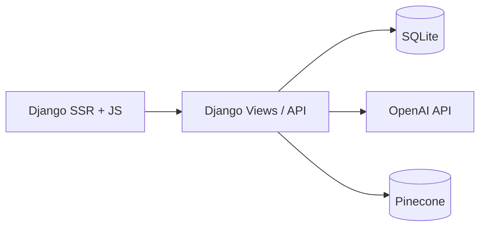

# LG Home — LG 가전 AI 추천·상담 서비스

> SKN26 4th Project · Django 기반 가전 검색 + LangGraph 챗봇(LGneer) + 사용설명서 RAG

---

## 👥 Team
<table>
  <tr>
    <td align="center">
      <br />
      <b>박기은</b><br />
    </td>
    <td align="center">
      <br />
      <b>서민혁</b><br />
    </td>
    <td align="center">
      <br />
      <b>유동현</b><br />
    </td>
    <td align="center">
      <br />
      <b>윤정연</b><br />
    </td>
    <td align="center">
      <br />
      <b>이레</b><br />
    </td>
    <td align="center">
      <br />
      <b>정영일</b><br />
    </td>
  </tr>
  <tr>
    <td align="center"><b>Role</b><br>Frontend</td>
    <td align="center"><b>Role</b><br>Frontend</td>
    <td align="center"><b>Role</b><br>Backend</td>
    <td align="center"><b>Role</b><br>Modeling</td>
    <td align="center"><b>Role</b><br>Database</td>
    <td align="center"><b>Role</b><br>Modeling</td>
  </tr>
  <tr>
    <td align="center"><a href="https://github.com/gieun-Park"></a></td>
    <td align="center"><a href="https://github.com/minhyeok328"></a></td>
    <td align="center"><a href="https://github.com/Ocean-2930"></a></td>
    <td align="center"><a href="https://github.com/dimolto3"></a></td>
    <td align="center"><a href="https://github.com/leere2424"></a></td>
    <td align="center"><a href="https://github.com/wjdduddlf112"></a></td>
  </tr>

</table>

---

## 1. Overview

### 1.1 소개

**LG Home**은 LG 가전(TV, 냉장고, 세탁기, 에어컨, 청소기)을 대상으로 한 **통합 검색·추천 웹 서비스**입니다.

사용자는 두 가지 방식으로 제품을 탐색할 수 있습니다.

1. **필터 검색 UI** — 카테고리·가격·스펙 조건을 선택해 상품 목록을 조회
2. **LG봇(LGneer)** — 「100만 원 이하 500L 냉장고」「세탁기 UE 에러가 뭐야?」처럼 **자연어**로 질의하면, AI가 조건을 구조화해 DB·매뉴얼을 검색하고 답변

챗봇은 **LangGraph**로 여러 단계(범위 판별, 제품군 분류, 의도·슬롯 추출, DB/RAG 검색, 답변 생성)를 거치며, 사용설명서 Q&A는 **Pinecone 벡터 검색(RAG)**을 활용합니다.

### 1.2 문제 정의

- 가전 구매 시 **스펙 항목이 많고** 카테고리마다 비교 기준이 달라, 원하는 조건을 찾기 어렵다.
- 사용설명서·고객지원 정보는 **분산**되어 있어, 기능 사용법·오류 코드를 빠르게 확인하기 어렵다.
- 기존 쇼핑몰 검색은 **키워드·필터 중심**이라, 「우리 집에 맞는」「전기세 적게 쓰는」 같은 **맥락 있는 질문**에 약하다.

### 1.3 목표

- LG 가전 5개 카테고리에 대한 **구조화된 상품 DB** 구축 및 조건 검색 제공
- 자연어 → **검색 슬롯 자동 추출** → ORM 기반 상품 추천
- 사용설명서 **RAG**로 사용법·오류 해결 Q&A 지원
- **찜(관심 제품)** 범위 내 검색·상담 등 개인화 맥락 반영
- Django SSR + Tailwind로 **실사용 가능한 웹 UI** 제공

---

## 2. Features

| 구분 | 기능 | 설명 |
|------|------|------|
| 메인 | 카테고리 탐색 | TV·세탁기·냉장고·에어컨·청소기 바로가기 |
| 검색 | 필터 검색 | 카테고리별 스펙 필터, 가격 범위, 페이지네이션(12건/페이지) |
| 상품 | 상세 페이지 | 이미지·가격·스펙·매뉴얼 링크, 찜하기 |
| 채팅 | LG봇 | LangGraph 기반 대화, 대화방·히스토리, 추천 질문 |
| 계정 | 회원가입·로그인 | 닉네임·프로필 사진, 마이페이지 |
| 개인화 | 찜 목록 | 관심 제품 저장·해제, 챗봇 `from_favorites` 검색 |
| AI | fall case 처리 | 전자제품 상담 범위 밖 질문 정중 거절 |
| AI | 후속 질문 | 이전 검색 맥락을 활용한 연속 대화 |

---

## 3. Tech Stack

| 레이어 | 기술 |
|---|---|
| **Language** | Python 3.12+ |
| **Web Framework** | Django 6.0 |
| **Frontend** | Django Templates (SSR), Tailwind CSS v4, django-tailwind, 바닐라 JS |
| **LLM** | OpenAI `gpt-4o-mini` |
| **Embedding** | OpenAI `text-embedding-3-small` |
| **Orchestration** | LangGraph, LangChain Core |
| **Vector DB** | Pinecone (`user_manual` namespace) |
| **Database** | SQLite (개발), Django ORM |
| **Data Pipeline** | Selenium, BeautifulSoup, Jupyter(notebook) |
| **Config** | python-dotenv (`.env`) |

---

## 4. Directory Structure

```
4th_project/
├── config/                 # Django settings, urls, wsgi
├── accounts/               # 회원·찜(UserFavorite)
├── products/               # 상품 모델·검색 뷰·크롤링 데이터
│   └── data/raw/data_crawling/   # 카테고리별 CSV·크롤링 스크립트
├── chats/                  # 채팅방·메시지 모델·채팅 페이지
├── api/                    # send_chat 등 REST API
├── common/                 # LangGraph(llm.py), 에이전트(llm_agent.py), 벡터 검색
├── mainpage/               # 메인 페이지
├── templates/              # 페이지·컴포넌트 HTML
├── static/                 # JS, CSS, 이미지, 필터 JSON
├── theme/                  # Tailwind 빌드 (django-tailwind)
├── docs/                   # frontend.md 등
├── manage.py
├── requirements.txt
└── README.md
```

---

## 5. Data Pipeline

### 5.1 수집

- **대상**: LG전자 공식몰 가전 카테고리 (TV, 에어컨, 냉장고, 청소기, 세탁기)
- **방식**: `products/data/raw/data_crawling/` — Selenium + BeautifulSoup 기반 크롤링
- **산출물**: 카테고리별 `*_all_products.csv`, 상품 링크·HTML 스냅샷

### 5.2 전처리

- Notebook(`*_db.ipynb`, `loaddata.ipynb`)으로 CSV 정제 후 Django 모델 스키마에 맞게 적재
- 제품 코드 prefix로 카테고리 구분 (`TVT`, `ACT`, `REF`, `VAC`, `WMT`)

### 5.3 저장

| 저장소 | 내용 |
|--------|------|
| **SQLite** | `ProductTV`, `ProductFridge`, `ProductWash`, `ProductAC`, `ProductVAC` 등 |
| **Pinecone** | 사용설명서 청크(메타: `product_code`, `page_number`, `product_code_header`) |

### 5.4 활용 (Runtime)

```
사용자 질의
  → fall_case 판별 (범위 밖이면 종료)
  → 후속 질문 / 제품군 분류 (TVT·ACT·REF·VAC·WMT)
  → intent_router (카테고리별 슬롯 추출 + vector_search 쿼리)
  → db_search (ORM 조건 검색, 찜 범위 옵션)
  → [결과 있음] answer_with_result (DB + 매뉴얼 RAG 근거 답변)
  → [결과 없음] answer_without_result / reverse_condition
```

### 5.5 시스템 및 LLM 아키텍처

#### 시스템 아키텍처



#### LLM 아키텍처 (LangGraph)

| 노드 | 역할 |
|------|------|
| `fall_case_node` | 상담 범위 밖 질문 거절 |
| `subsequence_router` | 후속 질문 여부 판별 |
| `product_classification` | TV/에어컨/냉장고/청소기/세탁기 분류 |
| `intent_router` | 자연어 → 검색 슬롯(structured output) |
| `db_search` | ORM 상품 검색 |
| `answer_with_result` | DB + 매뉴얼 RAG 기반 최종 답변 |
| `answer_without_result` | 검색 실패 안내 |

구현: `common/llm.py`, 프롬프트·구조화 출력: `common/llm_agent.py`, 벡터 검색: `common/vector_search.py`

---

## 6. Database Schema

### 엔티티 테이블 (상품)

| Table | 카테고리 | 주요 컬럼 |
|---|---|---|
| `ProductTV` | TV | `product_code`, `name`, `price`, `screen_size`, `display_type`, `manual_link` |
| `ProductFridge` | 냉장고 | `total_cap`, `door_cnt`, `smart_diag`, `ice_maker`, … |
| `ProductWash` | 세탁기 | `washing_cap`, `drying_cap`, `door_design`, … |
| `ProductAC` | 에어컨 | `cool_cap`, `coverage`, `color`, … |
| `ProductVAC` | 청소기 | `suction_power`, `battery_cnt`, … |

### 관계·계정 테이블

| Table | 의미 |
|---|---|
| `accounts_account` | 사용자(닉네임, 프로필 사진) |
| `accounts_userfavorite` | 찜 — `product_code` |
| `chats_chatroom` | 대화방, `agent_state`(JSON) |
| `chats_singlechat` | 메시지(`is_userchat`, `content`) |

### ERD (개요)

```
Account 1──N UserFavorite
Account 1──N Chatroom 1──N SingleChat
Product* (카테고리별 독립 테이블, product_code PK)
```

---

## 7. Installation

### 7.1 사전 요구사항

- Python 3.12+
- Node.js / npm (Tailwind 빌드)
- OpenAI API Key, Pinecone API Key & Host
- (크롤링만 할 경우) Chrome + Selenium WebDriver

### 7.2 설치 절차 (Windows / PowerShell 기준)

```powershell
cd 4th_project
python -m venv .venv
.\.venv\Scripts\Activate.ps1
pip install -r requirements.txt

cd theme\static_src
npm install
npm run build
cd ..\..

python manage.py migrate
# 상품 데이터 적재: products/loaddata.ipynb 또는 팀 제공 db.sqlite3 사용
python manage.py runserver
```

> 스타일 개발 시 `theme/static_src`에서 `npm run dev`를 별도 터미널에서 실행합니다.

### 7.3 환경변수 설정

프로젝트 루트에 `.env` 파일을 생성합니다.

```env
OPENAI_API_KEY=sk-...
PINECONE_API_KEY=...
PINECONE_HOST=...
```

`config/settings.py`에서 `load_dotenv()`로 로드됩니다.

### 7.4 데이터베이스

```powershell
python manage.py migrate
# 초기 상품 데이터는 팀 내부 절차(노트북 적재 또는 db.sqlite3)에 따름
```

---

## 8. Usage

### 8.1 웹 앱 실행 (권장)

```powershell
python manage.py runserver
```

브라우저에서 `http://127.0.0.1:8000/` 접속

| 경로 | 설명 |
|------|------|
| `/` | 메인 · LG봇 CTA |
| `/products/` | 필터 검색 |
| `/products/<code>/` | 상품 상세 |
| `/chats/` | LG봇 (로그인 필요) |
| `/accounts/` | 로그인 |
| `/accounts/mypage/` | 마이페이지·찜 |

### 8.2 API — 채팅 전송

```http
POST /api/send_chat/
Content-Type: application/json

{
  "chat_id": null,
  "user_input": "500L 이상 냉장고 추천해줘"
}
```

응답: `response`, `response_tail`, `chat_id`, `chatroom_name`

### 8.3 Python — LangGraph 직접 호출

채팅방·DB 컨텍스트 없이 그래프만 검증할 때는 `common/llm.py`의 `graph_instance` 또는 `debug.py`를 참고합니다.

### 8.4 RAG · 벡터DB 연동

- **임베딩**: `text-embedding-3-small`
- **검색**: `common/vector_search.py` → Pinecone `user_manual` namespace, `product_code_header` 필터
- **활용**: `intent_router`의 `vector_search` 슬롯 → `db_search` 이후 `answer_with_result`에서 매뉴얼 근거 인용

---

## 9. Example

**제품 검색**

| 입력 | 기대 동작 |
|------|-----------|
| 「100만 원 이하 55인치 TV」 | `product_type=TVT`, `price_lte`, `screen_size` 등 슬롯 추출 후 목록 응답 |
| 「찜한 제품 중 에너지 1등급 냉장고」 | `from_favorites=True`, REF 카테고리 DB 검색 |

**사용설명서 Q&A**

| 입력 | 기대 동작 |
|------|-----------|
| 「세탁기 UE 에러가 뭐야?」 | WMT 분류 → 매뉴얼 RAG → 에러 설명 + 출처 페이지 |
| 「에어컨 필터 청소 방법」 | ACT + vector_search → 매뉴얼 단계 안내 |

**범위 밖**

| 입력 | 기대 동작 |
|------|-----------|
| 「오늘 날씨 어때?」 | fall case — 전자제품 상담 범위 안내 후 종료 |

---

## 10. Evaluation Results

평가 기준 및 결과는 **작성 예정**입니다. 확정 후 아래 표를 채웁니다.

### 10.1 평가 설정
- 미정 (질의 세트, Pass 기준, 채점 항목)

### 10.2 차수별 핵심 성능 비교
| Stage | Report | Pass/Total | Pass Rate | Avg Score | Route | Payload | Target | Answer | Retrieval |
|---|---|---:|---:|---:|---:|---:|---:|---:|---:|
| 미정 | 미정 | 미정 | 미정 | 미정 | 미정 | 미정 | 미정 | 미정 | 미정 |

### 10.3 질의 유형별 비교 (`embedding` / `fixed`)
| Stage | Embedding Pass Rate | Fixed Pass Rate |
|---|---:|---:|
| 미정 | 미정 | 미정 |

### 10.4 차수별 실패 패턴과 보완 포인트
- 미정

### 10.5 무엇을 추가로 보완해야 하는가
- 미정

### 10.6 재현 방법
```powershell
# 평가 스크립트·재현 절차 확정 후 기입
```

---

## 11. Limitations

1. **데이터 범위**: LG 가전 5개 카테고리·공식몰 크롤링 데이터에 한정
2. **비로그인 찜**: 일부 UI에서 로그인 가드가 약함
3. **비밀번호 찾기·결제**: UI만 존재, 서버 미연동
4. **리뷰/Q&A 탭**: 상품 상세 일부 목업 데이터
5. **LLM 환각**: 검색 결과 없을 때 안내하지만, 프롬프트·평가로 지속 보완 필요

---

## 12. Future Work

- [ ] 평가 세트·자동 채점 파이프라인 정리
- [ ] 비로그인 UX(찜·채팅) 일관성 개선
- [ ] 비밀번호 재설정·이메일 인증
- [ ] 배포 환경(PostgreSQL, 정적 파일 CDN) 구성
- [ ] 카테고리·브랜드 확장 검토

---
## 13. Service Expansion & Business Model

- **B2C**: 가전 구매 전 단계의 AI 상담·비교 도구로 파트너몰·제조사 채널 연동 가능
- **B2B**: 콜센터·매뉴얼 검색 보조, 사내 지식 RAG 확장
- **수익 모델(안)**: 제휴 링크·프리미엄 필터·기업용 API — 구체화 예정

---

## 14. Output
- **요구사항 정의서**: _(링크 추가)_
- **화면설계서**: `docs/frontend.md` (프론트 위키·체크리스트)
- **개발된 LLM 연동 애플리케이션**: 본 저장소 (`/chats/`, `common/`)
- **시스템 구성도**: README §5.5
- **테스트 계획 및 결과보고서**: §10 (작성 예정)

---

## 15. 프로젝트 회고

### 개인 회고
<table style="width: 100%; border-collapse: collapse; border: 1px solid #ddd;">
    <thead>
        <tr style="background-color: #f8f9fa;">
            <th style="width: 20%; border: 1px solid #ddd; padding: 10px;">이름</th>
            <th style="border: 1px solid #ddd; padding: 10px;">회고</th>
        </tr>
    </thead>
    <tbody>
        <tr>
            <td style="text-align: center; border: 1px solid #ddd;">박기은</td>
            <td style="border: 1px solid #ddd; padding: 10px;"></td>
        </tr>
        <tr>
            <td style="text-align: center; border: 1px solid #ddd;">서민혁</td>
            <td style="border: 1px solid #ddd; padding: 10px;"></td>
        </tr>
        <tr>
            <td style="text-align: center; border: 1px solid #ddd;">유동현</td>
            <td style="border: 1px solid #ddd; padding: 10px;"></td>
        </tr>
        <tr>
            <td style="text-align: center; border: 1px solid #ddd;">윤정연</td>
            <td style="border: 1px solid #ddd; padding: 10px;"></td>
        </tr>
        <tr>
            <td style="text-align: center; border: 1px solid #ddd;">이레</td>
            <td style="border: 1px solid #ddd; padding: 10px;"></td>
        </tr>
        <tr>
            <td style="text-align: center; border: 1px solid #ddd;">정영일</td>
            <td style="border: 1px solid #ddd; padding: 10px;"></td>
        </tr>
    </tbody>
</table>


---

### 팀원 회고

<table style="width: 100%; border-collapse: collapse; border: 1px solid #ddd; margin-bottom: 30px;">
    <thead>
        <tr style="background-color: #f8f9fa;">
            <th style="width: 15%; border: 1px solid #ddd; padding: 10px;">대상자</th>
            <th style="width: 15%; border: 1px solid #ddd; padding: 10px;">작성자</th>
            <th style="border: 1px solid #ddd; padding: 10px;">회고 내용</th>
        </tr>
    </thead>
    <tbody>
        <tr>
            <td rowspan="5" style="text-align: center; font-weight: bold; border: 1px solid #ddd;">박기은</td>
            <td style="text-align: center; border: 1px solid #ddd;">서민혁</td>
            <td style="border: 1px solid #ddd; padding: 10px;"></td>
        </tr>
        <tr>
            <td style="text-align: center; border: 1px solid #ddd;">유동현</td>
            <td style="border: 1px solid #ddd; padding: 10px;"></td>
        </tr>
        <tr>
            <td style="text-align: center; border: 1px solid #ddd;">윤정연</td>
            <td style="border: 1px solid #ddd; padding: 10px;"></td>
        </tr>
        <tr>
            <td style="text-align: center; border: 1px solid #ddd;">이레</td>
            <td style="border: 1px solid #ddd; padding: 10px;"></td>
        </tr>
        <tr>
            <td style="text-align: center; border: 1px solid #ddd;">정영일</td>
            <td style="border: 1px solid #ddd; padding: 10px;"></td>
        </tr>
    </tbody>
</table>
<table style="width: 100%; border-collapse: collapse; border: 1px solid #ddd; margin-bottom: 30px;">
    <thead>
        <tr style="background-color: #f8f9fa;">
            <th style="width: 15%; border: 1px solid #ddd; padding: 10px;">대상자</th>
            <th style="width: 15%; border: 1px solid #ddd; padding: 10px;">작성자</th>
            <th style="border: 1px solid #ddd; padding: 10px;">회고 내용</th>
        </tr>
    </thead>
    <tbody>
        <tr>
            <td rowspan="5" style="text-align: center; font-weight: bold; border: 1px solid #ddd;">서민혁</td>
            <td style="text-align: center; border: 1px solid #ddd;">박기은</td>
            <td style="border: 1px solid #ddd; padding: 10px;"></td>
        </tr>
        <tr>
            <td style="text-align: center; border: 1px solid #ddd;">유동현</td>
            <td style="border: 1px solid #ddd; padding: 10px;"></td>
        </tr>
        <tr>
            <td style="text-align: center; border: 1px solid #ddd;">윤정연</td>
            <td style="border: 1px solid #ddd; padding: 10px;"></td>
        </tr>
        <tr>
            <td style="text-align: center; border: 1px solid #ddd;">이레</td>
            <td style="border: 1px solid #ddd; padding: 10px;"></td>
        </tr>
        <tr>
            <td style="text-align: center; border: 1px solid #ddd;">정영일</td>
            <td style="border: 1px solid #ddd; padding: 10px;"></td>
        </tr>
    </tbody>
</table>
<table style="width: 100%; border-collapse: collapse; border: 1px solid #ddd; margin-bottom: 30px;">
    <thead>
        <tr style="background-color: #f8f9fa;">
            <th style="width: 15%; border: 1px solid #ddd; padding: 10px;">대상자</th>
            <th style="width: 15%; border: 1px solid #ddd; padding: 10px;">작성자</th>
            <th style="border: 1px solid #ddd; padding: 10px;">회고 내용</th>
        </tr>
    </thead>
    <tbody>
        <tr>
            <td rowspan="5" style="text-align: center; font-weight: bold; border: 1px solid #ddd;">유동현</td>
            <td style="text-align: center; border: 1px solid #ddd;">박기은</td>
            <td style="border: 1px solid #ddd; padding: 10px;"></td>
        </tr>
        <tr>
            <td style="text-align: center; border: 1px solid #ddd;">서민혁</td>
            <td style="border: 1px solid #ddd; padding: 10px;"></td>
        </tr>
        <tr>
            <td style="text-align: center; border: 1px solid #ddd;">윤정연</td>
            <td style="border: 1px solid #ddd; padding: 10px;"></td>
        </tr>
        <tr>
            <td style="text-align: center; border: 1px solid #ddd;">이레</td>
            <td style="border: 1px solid #ddd; padding: 10px;"></td>
        </tr>
        <tr>
            <td style="text-align: center; border: 1px solid #ddd;">정영일</td>
            <td style="border: 1px solid #ddd; padding: 10px;"></td>
        </tr>
    </tbody>
</table>
<table style="width: 100%; border-collapse: collapse; border: 1px solid #ddd; margin-bottom: 30px;">
    <thead>
        <tr style="background-color: #f8f9fa;">
            <th style="width: 15%; border: 1px solid #ddd; padding: 10px;">대상자</th>
            <th style="width: 15%; border: 1px solid #ddd; padding: 10px;">작성자</th>
            <th style="border: 1px solid #ddd; padding: 10px;">회고 내용</th>
        </tr>
    </thead>
    <tbody>
        <tr>
            <td rowspan="5" style="text-align: center; font-weight: bold; border: 1px solid #ddd;">윤정연</td>
            <td style="text-align: center; border: 1px solid #ddd;">박기은</td>
            <td style="border: 1px solid #ddd; padding: 10px;"></td>
        </tr>
        <tr>
            <td style="text-align: center; border: 1px solid #ddd;">서민혁</td>
            <td style="border: 1px solid #ddd; padding: 10px;"></td>
        </tr>
        <tr>
            <td style="text-align: center; border: 1px solid #ddd;">유동현</td>
            <td style="border: 1px solid #ddd; padding: 10px;"></td>
        </tr>
        <tr>
            <td style="text-align: center; border: 1px solid #ddd;">이레</td>
            <td style="border: 1px solid #ddd; padding: 10px;"></td>
        </tr>
        <tr>
            <td style="text-align: center; border: 1px solid #ddd;">정영일</td>
            <td style="border: 1px solid #ddd; padding: 10px;"></td>
        </tr>
    </tbody>
</table>
<table style="width: 100%; border-collapse: collapse; border: 1px solid #ddd; margin-bottom: 30px;">
    <thead>
        <tr style="background-color: #f8f9fa;">
            <th style="width: 15%; border: 1px solid #ddd; padding: 10px;">대상자</th>
            <th style="width: 15%; border: 1px solid #ddd; padding: 10px;">작성자</th>
            <th style="border: 1px solid #ddd; padding: 10px;">회고 내용</th>
        </tr>
    </thead>
    <tbody>
        <tr>
            <td rowspan="5" style="text-align: center; font-weight: bold; border: 1px solid #ddd;">이레</td>
            <td style="text-align: center; border: 1px solid #ddd;">박기은</td>
            <td style="border: 1px solid #ddd; padding: 10px;"></td>
        </tr>
        <tr>
            <td style="text-align: center; border: 1px solid #ddd;">서민혁</td>
            <td style="border: 1px solid #ddd; padding: 10px;"></td>
        </tr>
        <tr>
            <td style="text-align: center; border: 1px solid #ddd;">유동현</td>
            <td style="border: 1px solid #ddd; padding: 10px;"></td>
        </tr>
        <tr>
            <td style="text-align: center; border: 1px solid #ddd;">윤정연</td>
            <td style="border: 1px solid #ddd; padding: 10px;"></td>
        </tr>
        <tr>
            <td style="text-align: center; border: 1px solid #ddd;">정영일</td>
            <td style="border: 1px solid #ddd; padding: 10px;"></td>
        </tr>
    </tbody>
</table>
<table style="width: 100%; border-collapse: collapse; border: 1px solid #ddd; margin-bottom: 30px;">
    <thead>
        <tr style="background-color: #f8f9fa;">
            <th style="width: 15%; border: 1px solid #ddd; padding: 10px;">대상자</th>
            <th style="width: 15%; border: 1px solid #ddd; padding: 10px;">작성자</th>
            <th style="border: 1px solid #ddd; padding: 10px;">회고 내용</th>
        </tr>
    </thead>
    <tbody>
        <tr>
            <td rowspan="5" style="text-align: center; font-weight: bold; border: 1px solid #ddd;">정영일</td>
            <td style="text-align: center; border: 1px solid #ddd;">박기은</td>
            <td style="border: 1px solid #ddd; padding: 10px;"></td>
        </tr>
        <tr>
            <td style="text-align: center; border: 1px solid #ddd;">서민혁</td>
            <td style="border: 1px solid #ddd; padding: 10px;"></td>
        </tr>
        <tr>
            <td style="text-align: center; border: 1px solid #ddd;">유동현</td>
            <td style="border: 1px solid #ddd; padding: 10px;"></td>
        </tr>
        <tr>
            <td style="text-align: center; border: 1px solid #ddd;">윤정연</td>
            <td style="border: 1px solid #ddd; padding: 10px;"></td>
        </tr>
        <tr>
            <td style="text-align: center; border: 1px solid #ddd;">이레</td>
            <td style="border: 1px solid #ddd; padding: 10px;"></td>
        </tr>
    </tbody>
</table>
