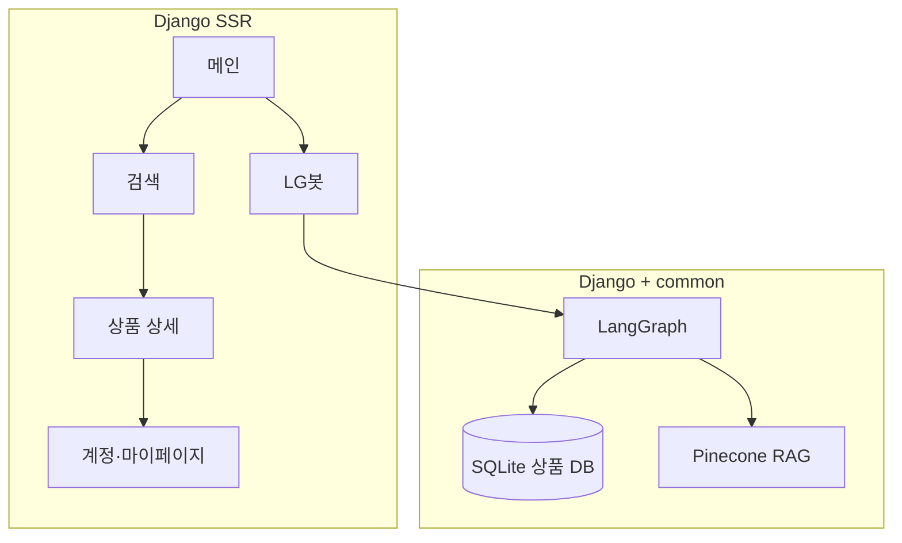

# 프로젝트 개요

[← Docs 홈](../README.md) · [시스템 아키텍처](../02-architecture/system-architecture.md)

## 서비스 소개

**LG Home**은 LG 가전 5개 카테고리(TV, 냉장고, 세탁기, 에어컨, 청소기)를 대상으로 한 **통합 검색·AI 상담** 웹 서비스입니다.

| 탐색 방식 | 설명 |
|-----------|------|
| **필터 검색 UI** | 카테고리·가격·스펙 조건 선택 → ORM 검색 |
| **LG봇 (LGneer)** | 자연어 질의 → LangGraph 슬롯 추출 → DB·매뉴얼 RAG |

## 팀·파트 구성

| 파트 | 담당 | Docs |
|------|------|------|
| Frontend | 박기은, 서민혁 | [03-frontend](../03-frontend/README.md) |
| Backend | 유동현 | [04-backend](../04-backend/README.md) |
| Database | 이레 | [05-database](../05-database/schema-and-erd.md) |
| Modeling (AI) | 윤정연, 정영일 | [07-ai-modeling](../07-ai-modeling/README.md) |

## 핵심 기능 맵

## 기술 스택 요약

| 레이어 | 기술 |
|--------|------|
| Web | Django 6.0, Templates SSR, Tailwind v4 |
| DB | SQLite, Django ORM |
| LLM | OpenAI `gpt-4o-mini`, LangGraph |
| Vector | Pinecone (`user_manual`), `text-embedding-3-small` |
| Data | Selenium·BeautifulSoup 크롤링, Jupyter 적재 |

상세 스택·제한사항·로드맵은 [루트 README §3·§11·§12](../../README.md)를 참고하세요.

## 관련 문서

- [개발 환경](../01-getting-started/development-environment.md)
- [기능별 문서 인덱스](../08-features/README.md)
- [API 명세](../06-api/rest-api.md)
