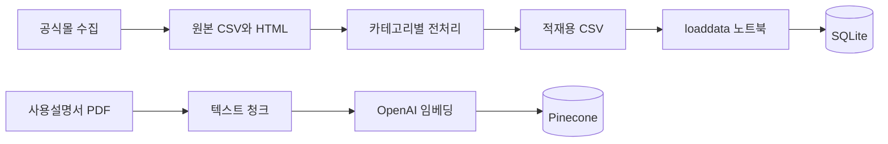

# 데이터 흐름

[문서 홈](../README.md) · [스키마와 ERD](../05-database/schema-and-erd.md)

## 상품 데이터 준비

| 단계 | 저장소 경로 | 주의할 계약 |
|---|---|---|
| 수집 | [raw/data_crawling](../../data/products/raw/data_crawling/) | Selenium·BeautifulSoup, 제품 링크·HTML·CSV |
| 정제 | [preprocessing](../../data/products/preprocessing/) | 카테고리별 사양과 타입 변환 |
| 적재 자료 | [database](../../data/products/database/) | 제품 5종 CSV와 `ScreenResolution.csv` |
| DB 적재 | [loaddata.ipynb](../../notebooks/data/loaddata.ipynb) | NaN·빈 값 정리, 필드 변환, `bulk_create` |
| 매뉴얼 준비 | [embedding](../../data/products/embedding/) | PDF 수집·청크·임베딩·Pinecone 업로드 |

상품 적재 노트북에는 기존 행 삭제가 있습니다. 해상도 테이블을 참조하는 TV를 먼저 삭제하고, 다시 적재할 때 TV의 외래키 참조 대상이 먼저 존재해야 합니다. 자동화된 관리 명령이나 주기적 갱신 스케줄은 없습니다.

## 웹 검색

`products.views.searchpage` → `common.utils.search_product` → `Product*.search` → `search_model` → QuerySet → `Paginator(12)` → HTML 순서입니다. 화면 필터 목록은 [search_filter_options.json](../../static/data/search_filter_options.json)에서 별도 로드합니다. 화면 옵션과 실제 모델 필드를 함께 변경해야 합니다.

## 상담 검색

1. `send_chat`이 로그인 사용자 소유 대화방을 찾거나 새로 만듭니다.
2. `add_chat`이 사용자 메시지를 저장하고 이전 상태·메시지를 복원합니다.
3. 범위·제품군·후속 질문을 판정하고 `intent_router`가 조건을 추출합니다.
4. `vector_search`가 있으면 **intent_router 안에서** 매뉴얼을 검색하고 반환된 상품 코드로 조건을 제한합니다. 찜 요청도 이 단계에서 사용자 찜 코드를 조건으로 바꿉니다.
5. `db_search`가 이전 슬롯과 새 조건을 병합하여 ORM을 조회합니다.
6. 0건은 이전 조건 유지 안내, 1~5건은 근거 답변, 5건 초과는 추가 조건 안내로 분기합니다.
7. 그래프 상태와 봇 메시지를 저장하고 `response`·`response_tail`을 반환합니다.

`response_tail`은 화면의 보조 안내이며 메시지 본문으로 저장하지 않습니다. 그래프 호출 중 실패하면 한 턴 전체가 자동 롤백되지 않습니다.

## 매뉴얼 데이터 계약

임베딩 모델은 `text-embedding-3-small`, namespace는 `user_manual`입니다. metadata의 `product_code`·`product_code_header`가 SQLite 상품 코드와 대응해야 합니다. `page_number`, `index`, `content`는 페이지 복원에 사용합니다. PDF·중간 CSV·벡터 인덱스는 저장소만 복제한다고 준비되지 않습니다.

노트북은 파일이 있는 폴더를 커널 작업 디렉터리로 사용합니다. DB 적재는 `notebooks/data/`, 평가 자료는 `notebooks/evaluation/`, 수집·전처리·임베딩은 `data/products/` 아래 해당 노트북 폴더가 기준입니다. 경로·입력 파일·출력 파일을 먼저 확인합니다. 필요한 노트북 패키지는 [개발 환경](../01-getting-started/development-environment.md)에 정리되어 있습니다.

자세한 검색 규칙과 한계는 [RAG 문서](../07-ai-modeling/rag-pinecone.md)를 참고합니다.
