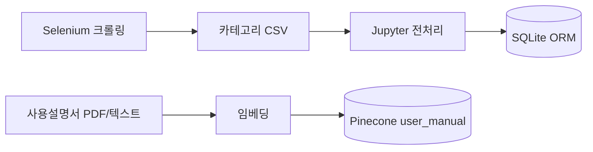

# 데이터 파이프라인

[← Docs 홈](../README.md) · [DB 스키마](../05-database/schema-and-erd.md)

## 파이프라인 개요

## 1. 수집 (Crawl)

| 항목 | 내용 |
|------|------|
| 대상 | LG전자 공식몰 — TV, 에어컨, 냉장고, 청소기, 세탁기 |
| 위치 | `products/data/raw/data_crawling/` |
| 도구 | Selenium, BeautifulSoup (`selenium_auto_module.py`) |
| 산출물 | `*_all_products.csv`, `*_product_links.txt`, HTML 스냅샷 |

## 2. 전처리·적재 (ETL)

- 카테고리별 `*_db.ipynb`에서 CSV 정제
- `products/loaddata.ipynb`로 Django 모델 스키마에 맞게 bulk 적재
- `product_code` 3자리 prefix로 카테고리 구분

| Prefix | 모델 | 카테고리 |
|--------|------|----------|
| TVT | ProductTV | TV |
| ACT | ProductAC | 에어컨 |
| REF | ProductFridge | 냉장고 |
| VAC | ProductVAC | 청소기 |
| WMT | ProductWash | 세탁기 |

## 3. 런타임 검색

### 웹 필터 검색

`products/views.searchpage` → `common.utils.search_product` → `Model.search(range, **conditions)`

### 챗봇 DB 검색

LangGraph `db_search` 노드 → 동일 `search_model()` + 슬롯(`from_favorites` 시 찜 코드 범위)

## 4. 매뉴얼 RAG (Pinecone)

| 항목 | 값 |
|------|-----|
| Namespace | `user_manual` |
| Embedding | `text-embedding-3-small` |
| 메타 필터 | `product_code_header` (TVT/ACT/REF/VAC/WMT) |
| 구현 | `common/vector_search.py` |

챗봇에서 `intent_router`의 `vector_search` 슬롯 → `answer_with_result`에서 근거 인용.

## 관련 문서

- [RAG 상세](../07-ai-modeling/rag-pinecone.md)
- [검색 기능](../08-features/search-and-filter.md)
- [개발 환경 — DB 초기화](../01-getting-started/development-environment.md#데이터베이스-초기화)
