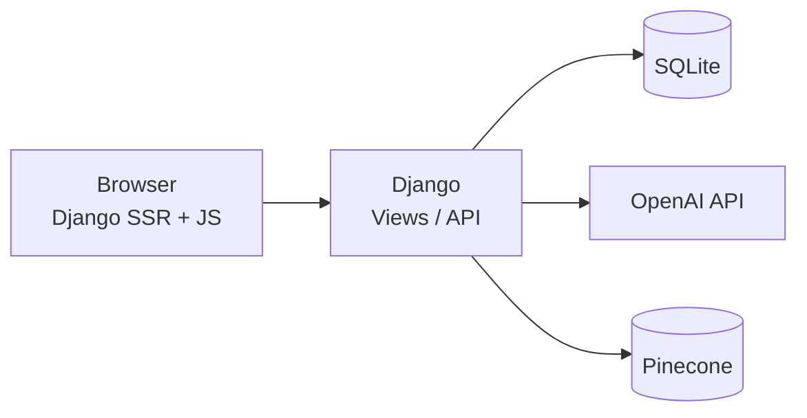
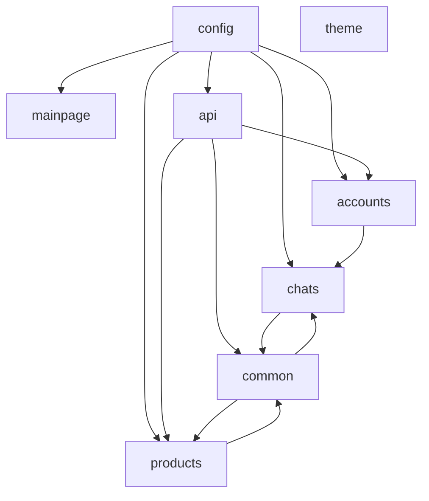

# 시스템 아키텍처

[← Docs 홈](../README.md) · [LLM 플로우](../07-ai-modeling/langgraph-flow.md)

## 전체 구성

| 계층 | 역할 | 주요 경로 |
|------|------|-----------|
| Presentation | 템플릿·정적 JS | `templates/`, `static/` |
| Application | URL·뷰·API | `config/`, `*/views.py`, `api/` |
| Domain / AI | 검색·그래프·RAG | `common/`, `products/models.py` |
| Data | ORM·벡터 | SQLite, Pinecone `user_manual` |

## Django 앱 의존 관계

## 요청 처리 패턴

### SSR 페이지

1. `config/urls.py` → 앱 `urls.py` → `views.py`
2. `render()` + `templates/*.html`
3. 필요 시 `static/js/*.js`에서 추가 API 호출

### 채팅 (AJAX)

1. `chatpage.js` → `POST /api/send_chat/`
2. `api/views.send_chat` → `common.llm.add_chat`
3. LangGraph 실행 → `Chatroom`·`SingleChat`·`agent_state` 갱신

## 인증

- 커스텀 사용자: `accounts.Account` (`AUTH_USER_MODEL`)
- 세션 쿠키 기반 (`django.contrib.auth`)
- 채팅·`send_chat` API: 로그인 필수

## 관련 문서

- [디렉터리 구조](directory-structure.md)
- [Django 앱 상세](../04-backend/django-apps.md)
- [REST API](../06-api/rest-api.md)
