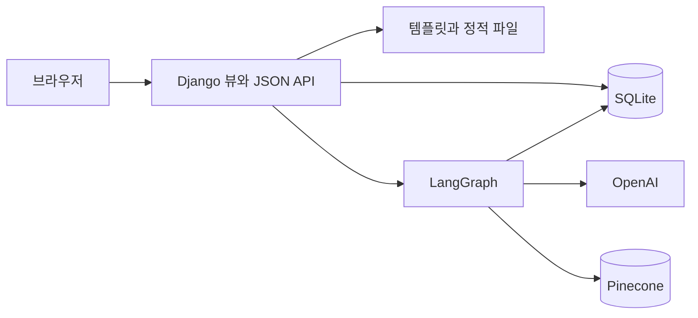

# 시스템 구조

[문서 홈](../README.md) · [데이터 흐름](data-flow.md)

## 전체 구성

```mermaid
flowchart LR
    Browser[브라우저] --> Django[Django 뷰와 JSON API]
    Django --> Template[템플릿과 정적 파일]
    Django --> SQLite[(SQLite)]
    Django --> Graph[LangGraph]
    Graph --> SQLite
    Graph --> OpenAI[OpenAI]
    Graph --> Pinecone[(Pinecone)]
```

Django가 HTML을 렌더링하고 JavaScript가 채팅 전송, 찜 토글, 필터 옵션 표시를 보완합니다. 독립된 프론트엔드 서버나 별도 AI 워커는 없습니다.

## 모듈 경계

| 경계 | 구현과 책임 |
|---|---|
| URL | [config/urls.py](../../config/urls.py)가 앱 URL을 연결 |
| 화면 | [templates](../../templates/)와 [static](../../static/) |
| 상품 | [products/views.py](../../products/views.py), [models.py](../../products/models.py) |
| 인증·개인화 | [accounts](../../accounts/)의 세션 인증·프로필·찜 |
| 대화 | [chats](../../chats/)의 방·메시지·상태 |
| AI 진입 | [api/views.py](../../api/views.py)의 `send_chat` → [common/llm.py](../../common/llm.py)의 `add_chat` |
| 외부 검색 | [common/vector_search.py](../../common/vector_search.py) |

`common`은 Django 앱이 아닌 공유 Python 패키지입니다. `api`는 URL로 연결되며 별도 모델을 사용하지 않습니다.

## 요청과 상태

검색은 GET 파라미터를 ORM 조건으로 바꾼 뒤 12개씩 페이지를 렌더링합니다. 채팅은 JSON POST 한 번 안에서 그래프를 동기 실행하고 최종 JSON 응답을 반환합니다. 스트리밍·백그라운드 큐는 없습니다.

로그인은 Django 세션을 사용하며 CSRF 미들웨어가 POST를 검사합니다. 대화방은 사용자 소유 관계로 제한하고, `agent_state`에 검색 조건과 그래프 상태를 JSON으로 저장합니다. 모델 호출에 필요한 전체 대화 문자열은 DB 메시지에서 다시 읽습니다.

## 운영상 경계

서버 프로세스는 웹 처리와 AI 호출을 함께 수행합니다. 외부 응답 지연이 요청 처리 시간에 영향을 주며, 클라이언트의 중복 클릭 방지가 서버의 동시 요청 잠금이나 트랜잭션을 대체하지 않습니다. SQLite와 Pinecone 사이에는 분산 트랜잭션이나 자동 정합성 검사가 없습니다.

[API 계약](../06-api/api-reference.md), [DB 관계](../05-database/schema-and-erd.md), [배포 조건](../09-deployment/deployment.md)을 함께 확인합니다.
