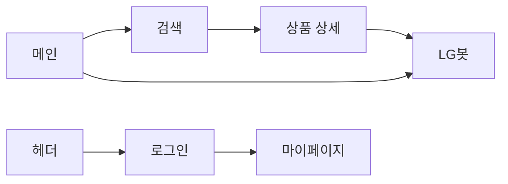

# 화면설계 · 프론트 위키

[← Frontend 홈](README.md) · [템플릿·컴포넌트](templates-components.md)

## 디자인 원칙

- **SSR 우선**: Django 템플릿으로 HTML 전달, 상호작용만 JS
- **컴포넌트 분리**: `templates/components/` 하위 도메인별 partial
- **스타일**: Tailwind v4 (`theme/static_src`), LG 톤 — 레드 포인트·라운드 카드

## 페이지 체크리스트

### 메인 (`mainpage.html`)

- [x] 5개 카테고리 카드 → 검색 페이지 딥링크
- [x] LG봇 CTA → `/chats/` (로그인 시) 또는 로그인 유도
- [x] 공통 헤더 (`components/header.html`)

### 검색 (`searchpage.html`)

- [x] 카테고리 탭 (TVT/REF/WMT/ACT/VAC)
- [x] 카테고리별 동적 필터 (`search_filter_options.json`)
- [x] 상품 그리드·카드
- [x] 페이지네이션 (12건/페이지)
- [ ] 비로그인 찜 UX 통일 (일부 화면 가드 약함)

### 상품 상세 (`productpage.html`)

- [x] 요약·스펙·액션(찜·구매 UI)
- [x] 탭 (상세/리뷰/Q&A — 리뷰·Q&A 일부 목업)
- [x] 찜 토글 → `wishlist-toggle.js` + 마이페이지 POST (`toggle_favorite`)
- [x] 찜 연속 클릭 방지·API 실패 `alert` (1차 개선)
- [ ] 구매하기 — UI만

### 채팅 (`chatpage.html`)

- [x] 대화방 사이드바·모바일 오버레이
- [x] 메시지 영역·입력·추천 질문
- [x] `POST /api/send_chat/` 연동 (`chatpage.js` + `api-response.js`)
- [x] 마크다운 URL allowlist·DOM sanitizer (1차 보안 개선)
- [x] 전송 중 `inFlight`·에러 말풍선 (`ApiResponse`)
- [x] 대화방 삭제 (POST)

### 계정

| 페이지 | 체크 |
|--------|------|
| 로그인 | [x] 세션 로그인 |
| 회원가입 | [x] 닉네임·프로필 사진 |
| 마이페이지 | [x] 프로필 수정·찜 목록 |
| 비밀번호 찾기 UI | [ ] 서버 미연동 |

## 화면 흐름 (요약)

## JS ↔ 서버 연동

| 파일 | 엔드포인트 |
|------|------------|
| `api-response.js` | (유틸) 챗봇·찜 `fetch` 응답 파싱·에러 문구 |
| `chatpage.js` | `POST /api/send_chat/` |
| `wishlist-toggle.js` | `POST /accounts/mypage/` (`toggle_favorite`) |
| `search/filter.js` | `GET` 정적 `search_filter_options.json` |
| `searchpage.js` | 검색 폼 submit → GET 쿼리스트링 (SSR) |

상세 모듈·로드 순서: [client-javascript.md](client-javascript.md)  
API 상세: [REST API](../06-api/rest-api.md)

## 1차 프론트 개선 (요약)

| 항목 | 상태 | 문서 |
|------|------|------|
| 챗봇 마크다운 URL 보안 | 반영 | [테스트 평가서 §0](frontend-test-report.md#0-1차-수정-반영-요약-재평가-전제) |
| 찜 중복 실행 방지 | 반영 | [client-javascript.md § 찜](client-javascript.md#찜-wishlist-togglejs) |
| API 실패 UX 표준화 | 챗봇·찜 반영, 검색 옵션 fetch 미연동 | [테스트 평가서 §5](frontend-test-report.md#5-우선순위별-개선-권장-사항-2차-이후) |

## 관련 문서

- [클라이언트 JS 모듈](client-javascript.md)
- [1차 수정 후 테스트 평가서](frontend-test-report.md)
- [페이지·URL](pages-and-routes.md)
- [기능: 검색](../08-features/search-and-filter.md)
- [기능: 채팅](../08-features/chat-lgneer.md)
