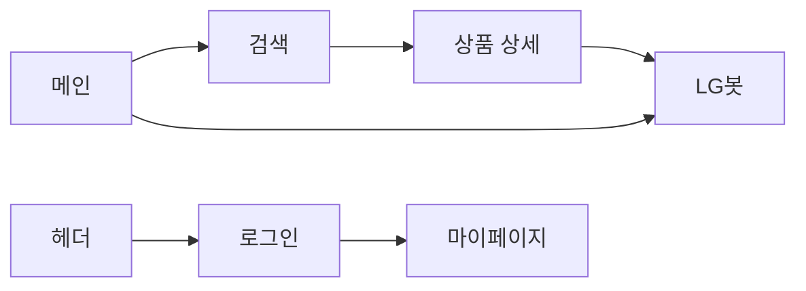

# 화면설계 · 프론트 위키

[← Frontend 홈](README.md) · [템플릿·컴포넌트](templates-components.md)

## 디자인 원칙

- **SSR 우선**: Django 템플릿으로 HTML 전달, 상호작용만 JS
- **컴포넌트 분리**: `templates/components/` 하위 도메인별 partial
- **스타일**: Tailwind v4 (`theme/static_src`), LG 톤 — 레드 포인트·라운드 카드

## 페이지 체크리스트

### 메인 (`mainpage.html`)

- [x] 5개 카테고리 카드 → 검색 페이지 딥링크
- [x] LG봇 CTA → `/chats/` (로그인 시) 또는 로그인 유도
- [x] 공통 헤더 (`components/header.html`)

### 검색 (`searchpage.html`)

- [x] 카테고리 탭 (TVT/REF/WMT/ACT/VAC)
- [x] 카테고리별 동적 필터 (`search_filter_options.json`)
- [x] 상품 그리드·카드
- [x] 페이지네이션 (12건/페이지)
- [ ] 비로그인 찜 UX 통일 (일부 화면 가드 약함)

### 상품 상세 (`productpage.html`)

- [x] 요약·스펙·액션(찜·구매 UI)
- [x] 탭 (상세/리뷰/Q&A — 리뷰·Q&A 일부 목업)
- [x] 찜 토글 → 마이페이지 POST (`toggle_favorite`)
- [ ] 구매하기 — UI만

### 채팅 (`chatpage.html`)

- [x] 대화방 사이드바·모바일 오버레이
- [x] 메시지 영역·입력·추천 질문
- [x] `POST /api/send_chat/` 연동 (`chatpage.js`)
- [x] 대화방 삭제 (POST)

### 계정

| 페이지 | 체크 |
|--------|------|
| 로그인 | [x] 세션 로그인 |
| 회원가입 | [x] 닉네임·프로필 사진 |
| 마이페이지 | [x] 프로필 수정·찜 목록 |
| 비밀번호 찾기 UI | [ ] 서버 미연동 |

## 화면 흐름 (요약)

## JS ↔ 서버 연동

| 파일 | 엔드포인트 |
|------|------------|
| `chatpage.js` | `POST /api/send_chat/` |
| `product_actions.html` (inline) | `POST /accounts/mypage/` (`toggle_favorite`) |
| `searchpage.js` | GET 쿼리스트링 필터 (SSR 리다이렉트) |

API 상세: [REST API](../06-api/rest-api.md)

## 관련 문서

- [페이지·URL](pages-and-routes.md)
- [기능: 검색](../08-features/search-and-filter.md)
- [기능: 채팅](../08-features/chat-lgneer.md)
