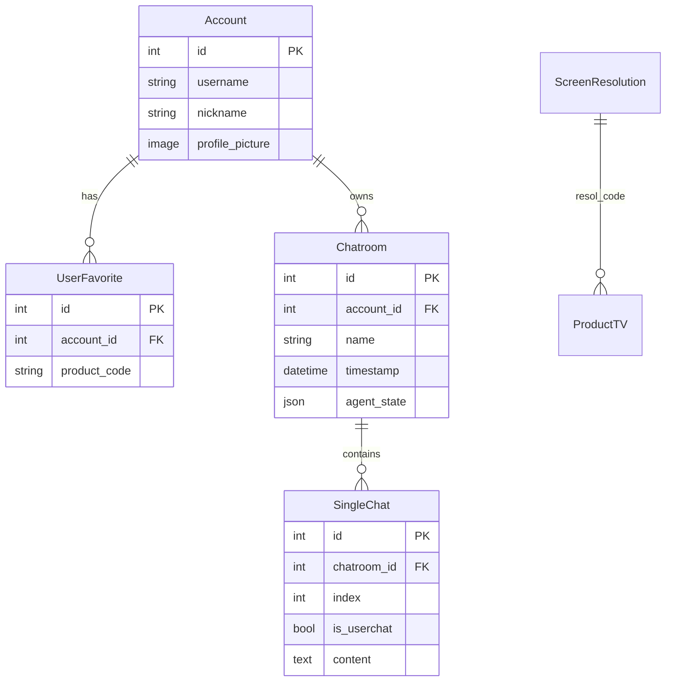

# DB 스키마 · ERD

[← Docs 홈](../README.md) · [데이터 파이프라인](../02-architecture/data-pipeline.md)

**담당**: 이레  
**엔진**: SQLite (개발), Django ORM

## ERD 개요



상품 테이블 5종은 **카테고리별 독립 테이블**이며 FK로 서로 연결되지 않습니다. `product_code`(PK)로 통합 식별합니다.

## 계정·채팅 테이블

### accounts_account

| 컬럼 | 타입 | 설명 |
|------|------|------|
| id | PK | |
| username | unique | 로그인 ID |
| password | hash | |
| nickname | varchar(12) | 표시명 |
| profile_picture | ImageField | `media/profiles/` |

### accounts_userfavorite

| 컬럼 | 타입 | 설명 |
|------|------|------|
| account_id | FK → Account | CASCADE |
| product_code | varchar(10) | TVT… / REF… 등 전체 코드 |

### chats_chatroom

| 컬럼 | 타입 | 설명 |
|------|------|------|
| agent_state | JSON | LangGraph 상태 (`state`, `slots`, `product_type` 등) |
| name | varchar(30) | 대화방 제목 (첫 질의 30자) |
| timestamp | datetime | 정렬·갱신용 |

### chats_singlechat

| 컬럼 | 타입 | 설명 |
|------|------|------|
| index | int | 방 내 순서 |
| is_userchat | bool | 사용자/봇 구분 |
| content | text | 메시지 본문 |

## 상품 테이블 (공통 패턴)

모든 Product* 테이블 공통 필드 예시:

| 컬럼 | 설명 |
|------|------|
| product_code | PK (예: `REFF12345`) |
| name | 상품명 |
| img_link | 이미지 URL |
| price | 가격 (원) |
| proficiency_level | 전력소비효율 등급 |
| power_consum | 전력 소비량 |
| manual_link | 사용설명서 URL |

### ProductTV (`ProductTV`)

추가: `screen_size`, `display_type`, `ref_rate`, `os_type`, `resol_code` → `ScreenResolution`

### ProductFridge (`ProductFridge`)

추가: `total_cap`, `door_cnt`, `ice_maker`, `smart_diag`, `install_type`, …

### ProductWash (`ProductWash`)

추가: `washing_cap`, `drying_cap`, `door_design`, `spin_op`, …

### ProductAC (`ProductAC`)

추가: `cool_cap`, `coverage`, `color`, 실내/실외기 치수, …

### ProductVAC (`ProductVAC`)

추가: `suction_power`, `battery_cnt`, 본체/타워 치수·무게, …

### ScreenResolution

TV 해상도 마스터 (`resol_code` PK)

## product_code 규칙

| Prefix (3자) | 테이블 | 예시 |
|--------------|--------|------|
| TVT | ProductTV | TVT… |
| ACT | ProductAC | ACT… |
| REF | ProductFridge | REF… |
| VAC | ProductVAC | VAC… |
| WMT | ProductWash | WMT… |

조회 유틸: `common.utils.get_product`, `get_model`

## 검색 API (ORM)

```python
ProductFridge.search(range=None, price__gte=1000000, name_icontains="디오스")
```

- `range`: `product_code__in` 제한 (찜 검색 등)
- 키 형식: Django `field__lookup` 또는 LLM 슬롯 `field_lookup` (`price_gte` 등) — `search_model()`이 통합 파싱

## SQLite 초기 데이터

| 경로 | 설명 |
|------|------|
| `products/data/database/` | ORM 적재 전 카테고리별 CSV |
| `products/loaddata.ipynb` | CSV → `Product*` 테이블 bulk 적재 |
| `db.sqlite3` | 개발 DB (팀 배포본 또는 로컬 적재 결과, `.gitignore`) |

## Pinecone (비관계형)

SQLite와 별도. 매뉴얼 청크 메타: `product_code`, `page_number`, `product_code_header`, `content`, `index`  
오프라인 적재: `products/data/embedding/`

→ [RAG 문서](../07-ai-modeling/rag-pinecone.md) · [데이터 파이프라인](../02-architecture/data-pipeline.md)

## 관련 문서

- [Backend products 앱](../04-backend/django-apps.md#products)
- [검색 기능](../08-features/search-and-filter.md)
