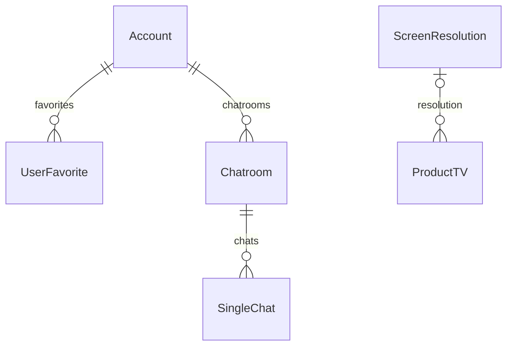

# 스키마와 ERD

[문서 홈](../README.md) · [데이터 흐름](../02-architecture/data-flow.md)

## 저장소 구분

SQLite는 상품·계정·찜·대화를 보관하고 Pinecone은 설명서 임베딩과 metadata를 보관합니다. 관계형 스키마의 기준은 [products/models.py](../../products/models.py), [accounts/models.py](../../accounts/models.py), [chats/models.py](../../chats/models.py)와 각 앱의 마이그레이션입니다.


```mermaid
erDiagram
    Account ||--o{ UserFavorite : favorites
    Account ||--o{ Chatroom : chatrooms
    Chatroom ||--o{ SingleChat : chats
    ScreenResolution o|--o{ ProductTV : resolution
```

상품 5종은 독립 테이블입니다. `UserFavorite.product_code`는 문자열이므로 상품 테이블과 DB 외래키 관계가 없습니다.

## 계정과 대화

| 모델 | 필드·제약 |
|---|---|
| `Account` | AbstractUser의 사용자명·비밀번호 등, `nickname` 길이 12, 선택적 `profile_picture` |
| `UserFavorite` | `account` FK(CASCADE), `product_code` 길이 10 |
| `Chatroom` | `account` FK(CASCADE), `name` 길이 30, `timestamp`, `agent_state` JSON |
| `SingleChat` | `chatroom` FK(CASCADE), `index`, `is_userchat`, `content` |

`agent_state` 초기값은 `state=initial`, `slots={}`입니다. 상담 후 사용자 ID·제품군·슬롯·매뉴얼 결과를 보관합니다. 메시지는 `index` 순으로 조회하고 메시지 추가 시 방의 timestamp를 갱신합니다.

`UserFavorite`에는 사용자·상품 코드 조합의 unique 제약이 없고, `SingleChat.index`에도 방별 unique 제약이 없습니다. 프로필 파일은 `media/profiles/`에 별도 저장됩니다. 상품 코드 필드는 상품 테이블에서는 길이 50, 찜에서는 길이 10으로 선언되어 있어 외부 DB 이전 시 길이 차이를 검토해야 합니다.

## 상품 모델

| 접두 | 모델·테이블 | 주요 사양 |
|---|---|---|
| TVT | `ProductTV` | 화면 크기, 디스플레이, 주사율, OS, 해상도 FK |
| ACT | `ProductAC` | 냉방 능력·면적, 전압, 주파수, 실내외기 크기 |
| REF | `ProductFridge` | 설치 방식, 도어 수, 냉장·냉동·총 용량, 제빙 |
| VAC | `ProductVAC` | 흡입력, 배터리 수, 본체·타워 크기와 무게 |
| WMT | `ProductWash` | 세탁·건조 용량, 도어, 수온, 탈수 |

공통으로 `product_code` 문자열 PK, `name`, `price`, `img_link`, `manual_link`, 소비전력 관련 필드를 가집니다. 대부분의 사양은 NULL을 허용합니다. 표시되지 않는 가격을 0원으로 해석하지 않습니다.

`ScreenResolution`은 `resol_code` PK와 이름·가로·세로 값을 가지며 `ProductTV.resol_code`는 선택적 FK, 삭제 정책은 PROTECT입니다.

## ORM 검색

```python
ProductFridge.search(range=None, price__gte=1000000, name_icontains="디오스")
```

공통 `search_model`은 웹의 `field__lookup`과 LLM의 `field_lookup`을 해석합니다. lookup은 `gte`, `lte`, `in`, `icontains`, `exact`입니다. 필드명·타입 변환이 맞지 않는 조건은 오류 응답 대신 건너뜁니다. 여러 `icontains` 조건은 연속 `filter()`로 적용하므로 AND입니다.

`range`가 비어 있으면 별도 범위 제한을 하지 않습니다. 그래프는 빈 `product_code_in`을 별도 처리하지만, 슬롯 병합 과정의 빈 조건 생략과 결합하여 찜·매뉴얼 결과가 없는 상황은 재검증이 필요합니다.

## 초기 데이터와 벡터 metadata

[database CSV](../../data/products/database/) 6종을 [적재 노트북](../../notebooks/data/loaddata.ipynb)으로 읽습니다. `migrate`는 CSV를 자동 적재하지 않습니다. Pinecone metadata는 `product_code`, `product_code_header`, `page_number`, `index`, `content`를 사용합니다. 해당 코드는 SQLite와 FK로 검증되지 않습니다.

[RAG](../07-ai-modeling/rag-pinecone.md) · [개발 환경](../01-getting-started/development-environment.md)
