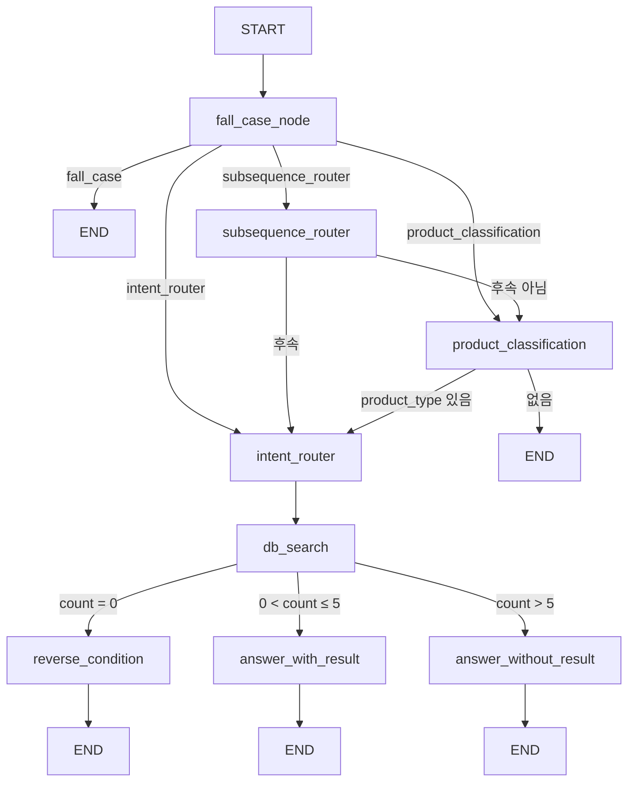

# LangGraph 플로우

[← AI Modeling 홈](README.md) · [RAG](rag-pinecone.md)

구현: `common/llm.py`, 프롬프트: `common/llm_agent.py`

## 그래프 다이어그램



`result_boundary = 5` — 이 개수 초과 시 `answer_without_result`.

## GraphState 주요 필드

| 필드 | 설명 |
|------|------|
| `state` | `initial` \| `subseq` \| `context` |
| `chats` | 대화 문자열 목록 |
| `product_type` | TVT / ACT / REF / VAC / WMT |
| `slots` | 검색 조건·`from_favorites` 등 |
| `is_fall_case` | 범위 밖 질문 |
| `is_subsequence` | 후속 질문 |
| `search_results` | ORM 검색 결과 |
| `manual_results` | RAG 청크 |
| `response` / `response_tail` | 답변 본문 / UI 보조 문자열(조건 안내 등) |

## 노드 역할

| 노드 | 역할 |
|------|------|
| `fall_case_node` | 전자제품 상담 범위 밖 거절 |
| `subsequence_router` | 「두 번째 거」 등 후속 질문 판별 |
| `product_classification` | 제품군 5종 분류 |
| `intent_router` | 자연어 → 슬롯(structured output), vector 쿼리 |
| `db_search` | ORM 검색, `result_count` 설정 |
| `reverse_condition` | 결과 0건 시 조건 완화 제안 |
| `answer_with_result` | DB + 매뉴얼 근거 답변 |
| `answer_without_result` | 과다/실패 안내 |

## 제품군 코드

| 코드 | 카테고리 |
|------|----------|
| TVT | TV |
| ACT | 에어컨 |
| REF | 냉장고 |
| VAC | 청소기 |
| WMT | 세탁기 |

## 런타임 진입: `add_chat()`

1. `Chatroom.agent_state`에서 이전 `state`, `slots`, `product_type` 복원
2. 사용자 메시지를 `SingleChat`에 저장
3. `graph_instance.invoke(state)`
4. `agent_state` 갱신 후 봇 메시지 저장
5. `(response, response_tail)` 반환

## 슬롯·검색 조건 병합

- `add_condition()`: 후속 대화 시 이전 슬롯과 새 조건 병합 (`gte`/`lte`/`in`/`icontains` 규칙)
- `from_favorites`: `get_favorites(user_id)` → `range` 인자로 `search_model`에 전달

## 디버깅

```powershell
# 프로젝트 루트
python debug.py
```

채팅방 없이 `graph_instance`만 검증할 때 사용합니다.

## 관련 문서

- [채팅 기능](../08-features/chat-lgneer.md)
- [REST send_chat](../06-api/rest-api.md#post-apisend_chat)
- [DB 검색](../05-database/schema-and-erd.md#검색-api-orm)
