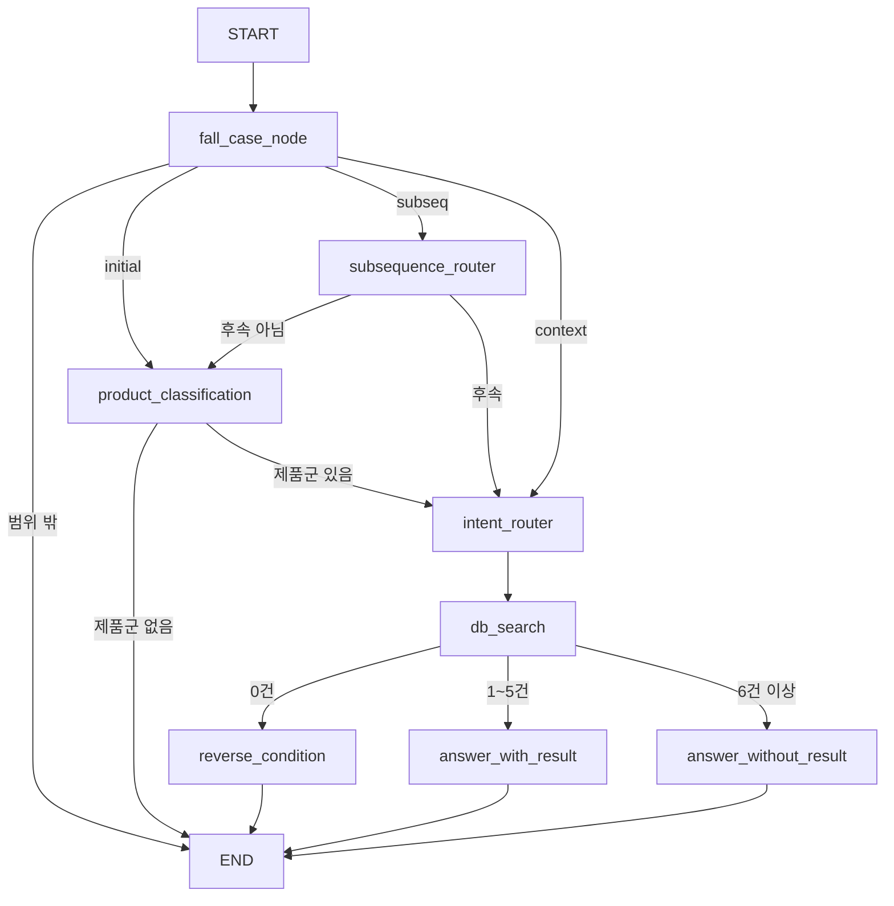

# LangGraph 흐름

[AI 구현](README.md) · [RAG](rag-pinecone.md)

구현은 [common/llm.py](../../common/llm.py), 모델 호출과 출력 구조는 [common/llm_agent.py](../../common/llm_agent.py)에 있습니다.

## 상태와 분기


```mermaid
flowchart TD
    Start[START] --> Fall[fall_case_node]
    Fall -->|범위 밖| End[END]
    Fall -->|initial| Class[product_classification]
    Fall -->|subseq| Sub[subsequence_router]
    Fall -->|context| Intent[intent_router]
    Sub -->|후속 아님| Class
    Sub -->|후속| Intent
    Class -->|제품군 없음| End
    Class -->|제품군 있음| Intent
    Intent --> DB[db_search]
    DB -->|0건| Reverse[reverse_condition]
    DB -->|1~5건| Answer[answer_with_result]
    DB -->|6건 이상| More[answer_without_result]
    Reverse --> End
    Answer --> End
    More --> End
```

`result_boundary=5`입니다. `answer_without_result`는 0건 처리가 아니라 결과가 많아 추가 조건을 요청하는 경로입니다. 0건이면 `reverse_condition`이 기존 슬롯을 유지하고 조건을 되돌렸다는 고정 안내를 반환합니다. 새로운 대안을 자동 검색하는 노드는 아닙니다.

| 필드 | 의미 |
|---|---|
| `state` | initial: 제품군 필요, context: 조건 추가, subseq: 결과 후속 질의 |
| `product_type` | TVT·ACT·REF·VAC·WMT |
| `chats` | DB에서 복원한 대화 문자열 목록 |
| `slots` / `intent` | 기존 조건 / 이번 턴에서 추출·가공한 조건 |
| `search_results` / `result_count` | ORM 결과와 개수 |
| `manual_results` | 제품 코드·페이지·본문 |
| `next_state` | 다음 요청에서 복원할 상태 |
| `response` / `response_tail` | 답변 / 저장하지 않는 보조 안내 |

## 슬롯 추출과 병합

`intent_router`는 제품군별 Pydantic 출력에서 사양 조건, `from_favorites`, `vector_search`를 읽습니다. 찜 요청은 사용자 찜 코드를, 매뉴얼 요청은 벡터 검색이 반환한 상품 코드를 `product_code_in`으로 가공합니다.

`add_condition`은 같은 키의 `gte`를 큰 값, `lte`를 작은 값, `in`을 교집합, `icontains`를 목록 누적으로 병합합니다. 다른 조건은 새 값으로 교체합니다. 빈 조건은 생략하므로 빈 찜·매뉴얼 목록의 제한 유지 여부는 확인이 필요합니다. `db_search`에는 명시적으로 남은 빈 `product_code_in`을 0건으로 처리하는 분기가 있습니다.

## 대화 저장

`add_chat`은 방의 `agent_state`를 복원하고 사용자 메시지를 먼저 저장합니다. 그래프 실행 후 `state`, `product_type`, `slots`, `manual_results`를 방에 저장한 뒤 봇 메시지를 추가합니다. 별도 체크포인터·턴 단위 롤백·동시 요청 잠금은 없습니다.

## 직접 실행

```powershell
python debug.py
```

[debug.py](../../debug.py)는 웹 API 계약 검증을 대신하지 않는 그래프 실험 도구입니다. DB·환경변수·외부 API를 준비하고 스크립트의 입력을 확인한 후 실행합니다. [평가 기록](../10-quality/model-evaluation-history.md)은 별도 노트북의 과거 결과입니다.
