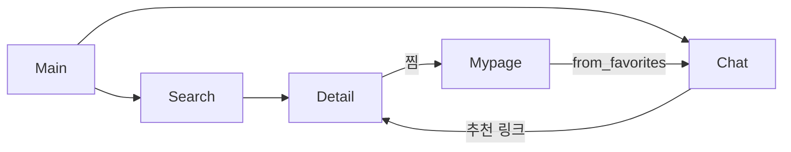

# 기능별 문서

[← Docs 홈](../README.md)

기능 단위로 사용자 흐름·구현·연동을 정리합니다.

| 기능 | 문서 | 핵심 URL/API |
|------|------|----------------|
| 메인 | [main-page.md](main-page.md) | `/` |
| 필터 검색 | [search-and-filter.md](search-and-filter.md) | `/products/` |
| 상품 상세 | [product-detail.md](product-detail.md) | `/products/<code>/` |
| LG봇 | [chat-lgneer.md](chat-lgneer.md) | `/chats/`, `POST /api/send_chat/` |
| 계정·찜 | [accounts-and-favorites.md](accounts-and-favorites.md) | `/accounts/*` |

## 기능 간 연결

## 파트별 상세

아키텍처·스키마·API는 각 파트 문서를 참고하세요.

- Frontend: [03-frontend](../03-frontend/README.md) — [1차 테스트 평가](../03-frontend/frontend-test-report.md) · [2차 QA](../03-frontend/frontend-final-report.md)
- Backend: [04-backend](../04-backend/README.md)
- DB: [05-database](../05-database/schema-and-erd.md)
- AI: [07-ai-modeling](../07-ai-modeling/README.md)
