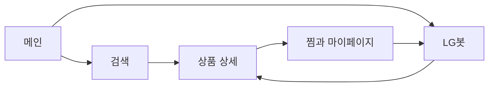

# 기능 안내

[문서 홈](../README.md)

## 화면별 기능

| 기능 | 사용자 동작 | 구현·문서 |
|---|---|---|
| 메인 | 카테고리 또는 LG봇 선택 | [메인](main-page.md) |
| 검색 | 제품군·가격·사양 선택, 페이지 이동 | [검색과 필터](search-and-filter.md) |
| 상세 | 이미지·사양·설명서 확인, 찜 토글 | [상품 상세](product-detail.md) |
| 채팅 | 질문 전송, 후속 질문, 방 전환·삭제 | [LG봇](chat-lgneer.md) |
| 계정 | 가입·로그인·프로필 변경·관심 제품 확인 | [계정과 찜](accounts-and-favorites.md) |

## 기능 연결

```mermaid
flowchart LR
    Main[메인] --> Search[검색]
    Search --> Detail[상품 상세]
    Detail --> Favorite[찜과 마이페이지]
    Main --> Chat[LG봇]
    Chat --> Detail
    Favorite --> Chat
```

검색과 상세는 비로그인으로 열 수 있습니다. 찜·마이페이지·채팅은 로그인 계정을 사용합니다. 마지막 화살표는 찜 코드를 상담 검색 조건으로 활용하는 관계이며 별도 자동 동기화 작업을 의미하지 않습니다.

## 구현 범위

구매 버튼에는 결제 흐름이 연결되어 있지 않고, 비밀번호 찾기 패널에도 재설정 API가 없습니다. 리뷰와 Q&A는 템플릿 예시이며 사용자 작성 데이터가 아닙니다. 카테고리는 저장된 5종으로 한정됩니다.

[API 계약](../06-api/api-reference.md) · [검증과 한계](../10-quality/verification-and-limitations.md)
