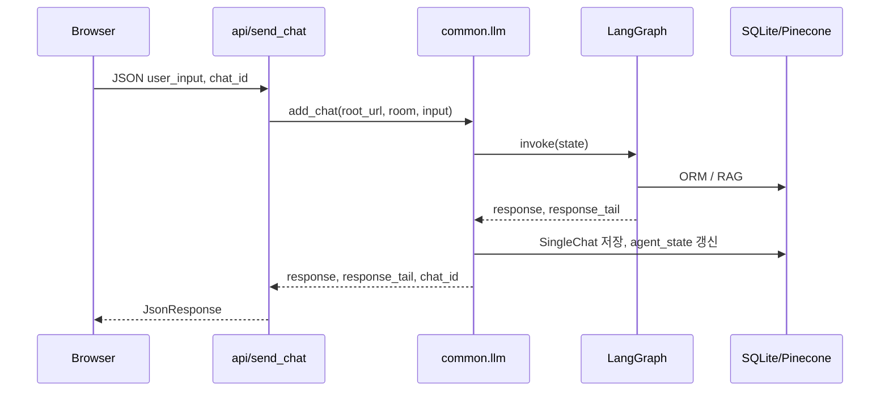

# LG봇 (LGneer) 채팅

[← 기능 인덱스](README.md) · [LangGraph](../07-ai-modeling/langgraph-flow.md)

## 개요

LangGraph 기반 AI 상담. 제품 추천(ORM)과 사용설명서 Q&A(RAG)를 자연어로 처리합니다.

## URL · API

| 항목 | 값 |
|------|-----|
| 페이지 | `/chats/` (로그인 필수) |
| API | `POST /api/send_chat/` |
| View | `chats.views.chatpage` |
| JS | `static/js/chatpage.js` |

## 화면 구성

- **사이드바**: 대화방 목록 (`chat_count > 0`), 삭제, `?chat_id=` 선택
- **메인**: 메시지 히스토리, 입력, 추천 질문
- **모바일**: 사이드바 오버레이

## 메시지 전송 흐름

`response`는 채팅 로그에 저장, `response_tail`은 상품 카드 HTML 등 UI용(로그 제외).

## 대화 상태 (`agent_state`)

| 키 | 용도 |
|----|------|
| `state` | initial / subseq / context |
| `product_type` | 마지막 제품군 |
| `slots` | 누적 검색 조건 |
| `manual_results` | RAG 캐시 |

## 주요 시나리오

| 입력 유형 | 그래프 경로 |
|-----------|-------------|
| 범위 밖 (날씨 등) | `fall_case_node` → END |
| 후속 (「두 번째 거」) | `subsequence_router` → 슬롯 유지 |
| 제품 추천 | classification → intent → db_search → answer_* |
| 매뉴얼 Q&A | vector_search → answer_with_result |
| 찜 범위 검색 | slots `from_favorites` → db_search |

예시: [루트 README §9](../../README.md#9-example)

## fall case · 후속 질문

- **fall case**: 전자제품 상담 외 질문 정중 거절
- **후속**: 이전 `slots`·검색 맥락 유지 (`add_condition`)

## 관련 문서

- [REST API send_chat](../06-api/rest-api.md#post-apisend_chat)
- [RAG](../07-ai-modeling/rag-pinecone.md)
- [계정·찜 — from_favorites](accounts-and-favorites.md)
