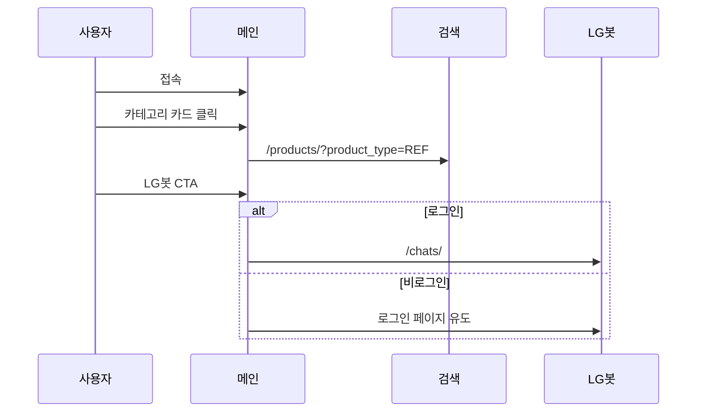

# 메인 페이지

[← 기능 인덱스](README.md) · [Frontend 화면설계](../03-frontend/frontend.md)

## 개요

LG 가전 5개 카테고리 진입점과 LG봇 CTA를 제공하는 랜딩 페이지입니다.

## URL · 구현

| 항목 | 값 |
|------|-----|
| URL | `/` |
| App | `mainpage` |
| Template | `templates/mainpage.html` |
| View | `mainpage.views.mainpage` |

## 사용자 흐름

## UI 구성

- `components/header.html` — 전역 네비
- `components/category_card.html` — 카테고리별 이미지·링크
- LG 브랜드 히어로·LGneer 소개 섹션

## 관련 문서

- [검색·필터](search-and-filter.md)
- [채팅](chat-lgneer.md)
- [페이지 URL 매핑](../03-frontend/pages-and-routes.md)
