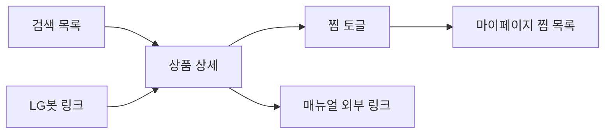

# 상품 상세

[← 기능 인덱스](README.md)

## 개요

단일 제품의 이미지·가격·스펙·매뉴얼 링크를 표시하고, 찜하기를 지원합니다.

## URL · 구현

| 항목 | 값 |
|------|-----|
| URL | `/products/<product_code>/` |
| View | `products.views.productpage` |
| Template | `productpage.html` |
| 조회 | `common.utils.get_product(product_code)` |

`product_code`는 prefix 3자 + 본문 (예: `REFF12345678`). 잘못된 코드는 `product_data=None` 처리.

## 사용자 흐름

## UI 섹션

| 컴포넌트 | 내용 |
|----------|------|
| `product_summary.html` | 이미지·이름·가격 |
| `product_detail_specs.html` | 카테고리별 스펙 테이블 |
| `product_tabs.html` | 상세/리뷰/Q&A (리뷰·Q&A 목업) |
| `product_actions.html` | 찜·구매 버튼 |

## 찜 연동

- 로그인 필수 (`#product-actions` `data-is-authenticated`)
- 클라이언트: `static/js/wishlist-toggle.js` (`productPageWishlistToggle`)
- `POST /accounts/mypage/` — `action=toggle_favorite`, `product_code`
- 응답: `{ "ok": true, "favorited": bool }`
- 연속 클릭 방지·API 실패 `alert` — `api-response.js` + in-flight 가드

대안 API: [POST /api/favorite/](../06-api/rest-api.md#post-apifavoriteproduct_code)  
프론트 상세: [client-javascript.md](../03-frontend/client-javascript.md)

## 관련 문서

- [계정·찜](accounts-and-favorites.md)
- [검색](search-and-filter.md)
- [DB 상품 테이블](../05-database/schema-and-erd.md#상품-테이블-공통-패턴)
