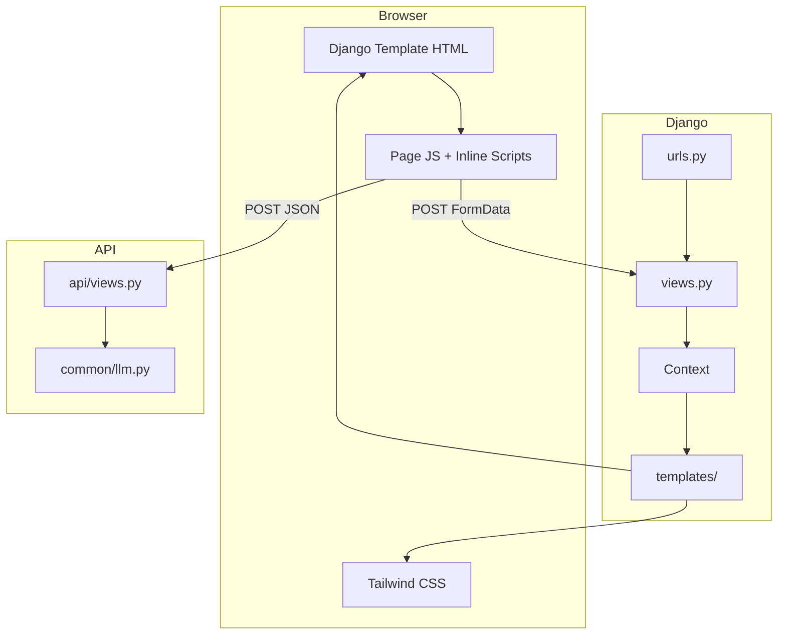
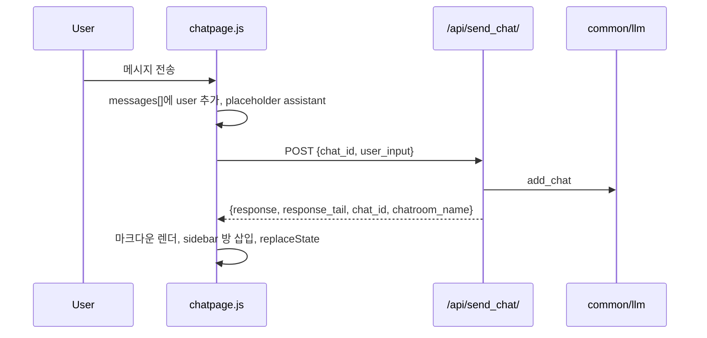
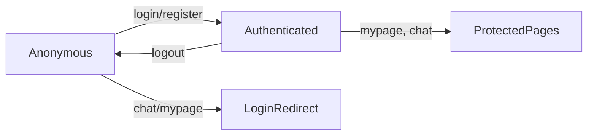

# Frontend Wiki — LG 가전 추천 서비스

이 문서는 프로젝트 프론트엔드의 기술 스택, 디렉터리 구조, 렌더링·상호작용 로직, 페이지별 동작을 위키 형태로 정리한 것입니다. 마지막에는 페이지·컴포넌트별 **사용자 평가 체크리스트**가 있습니다.

---

## 목차

1. [개요](#1-개요)
2. [기술 스택](#2-기술-스택)
3. [아키텍처 요약](#3-아키텍처-요약)
4. [디렉터리 구조](#4-디렉터리-구조)
5. [레이아웃·템플릿 계층](#5-레이아웃템플릿-계층)
6. [스타일링 (Tailwind CSS)](#6-스타일링-tailwind-css)
7. [JavaScript 전략](#7-javascript-전략)
8. [백엔드 연동 (URL · API)](#8-백엔드-연동-url--api)
9. [공통 컴포넌트](#9-공통-컴포넌트)
10. [페이지별 상세](#10-페이지별-상세)
11. [데이터·상태 흐름](#11-데이터상태-흐름)
12. [개발·빌드 방법](#12-개발빌드-방법)
13. [알려진 제한·미구현](#13-알려진-제한미구현)
14. [사용자 평가 체크리스트](#14-사용자-평가-체크리스트)

---

## 1. 개요

| 항목 | 내용 |
|------|------|
| **패러다임** | Django **서버 사이드 렌더링(SSR)** + 제한적 **바닐라 JavaScript** |
| **UI 프레임워크** | React/Vue 없음. Django Template + `` 컴포넌트 분리 |
| **스타일** | **Tailwind CSS v4** (`django-tailwind` + `theme` 앱) |
| **인터랙션** | 폼 POST(전통적), 일부 **Fetch API** (채팅, 찜, 필터 UI) |
| **디자인 톤** | LG 브랜드 레드(`red-600`), 라운드 카드(`rounded-3xl`), 밝은 배경(`#f5f5f7`) |

프론트는 **별도 SPA가 아니라** Django 뷰가 HTML을 내려주고, 페이지별 JS가 DOM을 보강하는 **하이브리드** 구조입니다.

---

## 2. 기술 스택

### 2.1 코어

| 기술 | 버전·역할 |
|------|-----------|
| **Django** | 6.x — 라우팅, 인증, 템플릿, ORM |
| **Django Templates** | `templates/` — 페이지·컴포넌트 HTML |
| **django-tailwind** | 4.x — ``로 빌드된 CSS 주입 |
| **Tailwind CSS** | 4.x — 유틸리티 클래스 기반 스타일 |
| **PostCSS** | Tailwind 빌드 파이프라인 |
| **daisyUI** | `styles.css`에 플러그인 등록 (실제 페이지는 주로 커스텀 Tailwind 사용) |
| **django.contrib.humanize** | 가격 `intcomma` 등 숫자 포맷 |

### 2.2 클라이언트 JavaScript

| 파일 | 역할 |
|------|------|
| `static/js/searchpage.js` | 검색 필터·칩·범위·활성 필터 pill·페이지네이션 UI |
| `static/js/chatpage.js` | 채팅 전송, 마크다운 렌더, 사이드바, 히스토리 URL 갱신 |
| `static/js/productpage.js` | 상품 탭 전환, 뒤로가기 |
| `static/js/loginpage.js` | 로그인 ↔ 비밀번호 찾기 패널 전환 |
| 인라인 `<script>` | 메인 슬라이더, 찜 토글(`product_actions`, `recent_products`), 프로필 수정 토글 |

**사용하지 않는 것:** npm 프론트 번들러(Vite/Webpack), TypeScript, React/Vue, jQuery.

### 2.3 정적 자산

| 경로 | 내용 |
|------|------|
| `static/` | JS, CSS, 이미지, `data/search_filter_options.json` |
| `theme/static/css/dist/styles.css` | Tailwind 빌드 결과 (``) |
| `media/` | 사용자 업로드 프로필 사진 등 |

### 2.4 설정 (`config/settings.py`)

```python
INSTALLED_APPS = [..., 'tailwind', 'theme']
TAILWIND_APP_NAME = 'theme'
TEMPLATES['DIRS'] = [BASE_DIR / 'templates']
STATICFILES_DIRS = [BASE_DIR / 'static']
LANGUAGE_CODE = "ko-kr"
```

---

## 3. 아키텍처 요약



**요청 처리 패턴**

1. **전체 페이지 갱신:** GET/POST 폼 → Django 뷰 → redirect 또는 `render()` → 새 HTML
2. **부분 갱신(JSON):** `fetch()` → `/api/...` 또는 `accounts:mypage` POST → JSON 응답 → DOM만 수정

---

## 4. 디렉터리 구조

```
4th_project/
├── templates/                    # 실제 서비스 UI (프로젝트 루트)
│   ├── base_page.html            # 전 페이지 공통 레이아웃
│   ├── mainpage.html
│   ├── searchpage.html
│   ├── productpage.html
│   ├── chatpage.html
│   ├── loginpage.html
│   ├── registerpage.html
│   ├── mypage.html
│   └── components/               # 재사용 파셜
│       ├── header.html
│       ├── category_card.html
│       ├── auth/
│       ├── account/
│       ├── chat/
│       ├── product/
│       └── search/
│           └── filters/          # 카테고리별 필터 필드
├── static/
│   ├── js/                       # 페이지별 스크립트
│   ├── css/search_filter.css     # 필터 칩 보조 스타일
│   ├── data/search_filter_options.json
│   └── images/                   # 메인 배너 이미지 등
├── theme/                        # django-tailwind 앱
│   ├── static_src/
│   │   ├── src/styles.css        # @import tailwindcss, @source 스캔 경로
│   │   └── package.json          # npm run dev / build
│   └── static/css/dist/styles.css
└── config/settings.py
```

> `theme/templates/base.html`은 django-tailwind 초기 샘플이며, **실 서비스는 `templates/base_page.html`을 사용**합니다.

---

## 5. 레이아웃·템플릿 계층

### 5.1 `base_page.html`

모든 페이지의 루트 레이아웃입니다.

| 블록 | 용도 |
|------|------|
| `` | `<title>` |
| `` | 페이지 전용 `<link>` 등 |
| `` | 본문 |
| `` | 하단 `<script src>` |

공통으로 `` 후 ``를 로드합니다.

### 5.2 페이지 템플릿 패턴

```django


  
  <main>...</main>

 ... 
```

### 5.3 컴포넌트 분리 원칙

- **페이지(`*page.html`):** 라우트 단위 조립, 섹션 배치
- **컴포넌트(`components/**`):** 헤더, 카드, 필터, 채팅 버블 등 **한 덩어리 UI**
- **필터:** `common.html`(공통) + `category_filters.html`(카테고리별) + `_fields.html`(필드 마크업)

``로 컨텍스트를 넘깁니다. (예: `recent_products.html`에 `wishlist=favorites`)

---

## 6. 스타일링 (Tailwind CSS)

### 6.1 빌드 파이프라인

1. 소스: `theme/static_src/src/styles.css`
2. `@source "../../../**/*.{html,py,js}"` — 프로젝트 전역 클래스 스캔
3. 빌드 출력: `theme/static/css/dist/styles.css`
4. 템플릿에서 ``로 링크

```bash
cd theme/static_src
npm run dev      # watch 개발
npm run build    # production minify
```

Windows에서는 `settings.py`의 `NPM_BIN_PATH`가 npm 경로를 가리킵니다.

### 6.2 디자인 토큰 (관례)

| 용도 | 클래스 예시 |
|------|-------------|
| 배경 | `bg-[#f5f5f7]`, `bg-white` |
| 강조색 | `bg-red-600`, `text-red-600`, `hover:bg-red-700` |
| 카드 | `rounded-3xl border border-gray-200/70 shadow-sm` |
| 버튼(Primary) | `rounded-full bg-red-600 px-8 py-3 text-white` |
| 버튼(Secondary) | `rounded-full border border-gray-200 bg-white` |
| 헤더 | `sticky top-0 z-40 backdrop-blur-md` |

### 6.3 보조 CSS

`static/css/search_filter.css` — 필터 칩 `[data-filter-chip]` pressed 상태, 빈 활성 필터 영역 숨김.

---

## 7. JavaScript 전략

### 7.1 로딩 위치

| 방식 | 사용처 |
|------|--------|
| `` | `loginpage`, `productpage`, `chatpage` |
| `` 하단 | `searchpage` (CSS link + script) |
| 인라인 `<script>` | `mainpage` 슬라이더, 찜/프로필 토글 |
| `data-*` 속성 | 필터·채팅·탭 — JS가 DOM 셀렉터로 연결 |

### 7.2 CSRF

- 폼: ``
- `fetch`: 헤더 `X-CSRFToken` + `credentials: 'same-origin'`
- 채팅: `chat_input.html`의 `data-csrf-token="{{ csrf_token }}"`

### 7.3 URL 상태

| 페이지 | URL 상태 |
|--------|----------|
| 검색 | `?product_type=REF&page=1&price__gte=...` — 필터 전부 쿼리스트링 |
| 채팅 | `?chat_id=123` — 대화방 선택; JS가 `history.replaceState`로 갱신 |
| 상품 | `/products/<product_code>/` |

---

## 8. 백엔드 연동 (URL · API)

### 8.1 페이지 URL

| URL | name | 뷰 | 템플릿 |
|-----|------|-----|--------|
| `/` | `mainpage:mainpage` | `mainpage.views.mainpage` | `mainpage.html` |
| `/products/` | `products:searchpage` | `products.views.searchpage` | `searchpage.html` |
| `/products/<code>/` | `products:productpage` | `products.views.productpage` | `productpage.html` |
| `/accounts/` | `accounts:loginpage` | `accounts.views.loginpage` | `loginpage.html` |
| `/accounts/register/` | `accounts:registerpage` | `accounts.views.registerpage` | `registerpage.html` |
| `/accounts/mypage/` | `accounts:mypage` | `accounts.views.mypage` | `mypage.html` |
| `/accounts/logout/` | `accounts:logout` | POST 로그아웃 | redirect |
| `/chats/` | `chats:chatpage` | `chats.views.chatpage` | `chatpage.html` |

### 8.2 API (`/api/`)

| Endpoint | Method | 프론트 사용 |
|----------|--------|-------------|
| `/api/send_chat/` | POST JSON | `chatpage.js` — 메시지 전송 |
| `/api/favorite/<code>/` | POST | 정의됨 (상품页은 mypage POST 사용) |
| `/api/check_favorite/<code>/` | POST | 정의됨 |

### 8.3 mypage 다목적 POST

`accounts:mypage`에 `action`으로 분기:

| action | 응답 | 호출처 |
|--------|------|--------|
| `toggle_favorite` | JSON `{ok, favorited}` | 상품 찜, 마이페이지 찜 해제 |
| `update_profile` | redirect | 프로필 수정 폼 |
| `logout` | redirect | 마이페이지 로그아웃 |

---

## 9. 공통 컴포넌트

### 9.1 `components/header.html`

- **역할:** 전역 네비게이션 (sticky)
- **로직:** `user.is_authenticated` 분기
  - 로그인: 로그아웃(POST) + 마이페이지 링크
  - 비로그인: 로그인 + 회원가입
- **브랜드:** `LG Home` → `mainpage:mainpage`

### 9.2 `components/category_card.html`

- **입력:** `label`, `product_type`
- **동작:** `searchpage?product_type=<code>&page=1` 링크 카드

---

## 10. 페이지별 상세

### 10.1 메인 (`mainpage.html`)

**URL:** `/`

**뷰 컨텍스트**

| 변수 | 설명 |
|------|------|
| `categories` | TV/세탁기/냉장고/에어컨/청소기 메타 |
| `test_var` | 로그인 닉네임 또는 `"비로그인 상태"` (현재 템플릿 미사용) |

**섹션**

1. **히어로 슬라이더** — 3슬라이드, 10초 자동 전환 (인라인 JS)
   - opacity / `pointer-events-none` 토글
   - 인디케이터 dot → active 시 `w-6` 바 형태
   - 각 슬라이드 CTA → `productpage` 고정 상품 코드
2. **LG봇 CTA** — `chats:chatpage` (로그인 필요, 미로그인 시 redirect)
3. **카테고리 그리드** — `category_card` × 5

**클라이언트 로직:** 서버 데이터 없이 순수 DOM 슬라이더.

---

### 10.2 검색 (`searchpage.html`)

**URL:** `/products/?product_type=REF&page=1&...`

**뷰 동작**

1. `product_type`, `page` 없으면 기본값(`REF`, `1`)으로 **redirect**
2. GET 파라미터(위 두 키 제외)를 `conditions`로 `search_product()`에 전달
3. 페이지당 12개 `Paginator`

**레이아웃**

```
[ category_tabs ]
[ search_filter (좌) ] [ result_header + product_grid + pagination (우) ]
```

**컴포넌트**

| 컴포넌트 | 역할 |
|----------|------|
| `category_tabs.html` | TV/WMT/REF/ACT/VAC 탭 — **탭 전환 시 필터 쿼리 초기화** (`page=1`만) |
| `search_filter.html` | GET 폼, hidden `product_type`, `page=1` |
| `filters/common.html` | 상품명, 가격 범위·프리셋 |
| `filters/category_filters.html` | `product_type`별 필드 |
| `search_result_header.html` | 결과 건수, 활성 필터 pill 영역 |
| `product_grid.html` | `product_card` 반복 |
| `pagination.html` | `data-*` + JS가 버튼 동적 생성 |

**`searchpage.js` 핵심 로직**

1. `search_filter_options.json` fetch → 칩 선택지 렌더
2. URL `SearchParams` ↔ 폼 입력 **복원**
3. 칩(single/multi), 토글(0/1), 범위(min/max clamp), 가격 프리셋
4. submit 시 빈 필드 `name` 제거 → 깔끔한 쿼리스트링
5. 활성 필터 pill 클릭 → 해당 파라미터 제거 URL로 이동
6. 페이지네이션: 현재 페이지 ± 윈도우, `…` gap

**product_type 코드**

| 코드 | 카테고리 |
|------|----------|
| TVT | TV |
| WMT | 세탁기 |
| REF | 냉장고 |
| ACT | 에어컨 |
| VAC | 청소기 |

---

### 10.3 상품 상세 (`productpage.html`)

**URL:** `/products/<product_code>/`

**뷰 컨텍스트**

| 변수 | 설명 |
|------|------|
| `product_type` | 모델 클래스명 (`ProductTV`, `ProductFridge`, …) |
| `product_data` | 상품 인스턴스 또는 None |
| `is_favorite` | 로그인 사용자 찜 여부 |

**구성**

1. 뒤로가기 버튼 → `productpage.js` (`history.back()`)
2. `product_summary` — 이미지, 이름, 가격, 매뉴얼 링크
3. `product_actions` — 찜하기 / 구매하기(미연동 UI)
4. `product_tabs` — 상세·스펙·리뷰·Q&A (리뷰/Q&A는 **목업 데이터**)
5. 하단 **카테고리별 상세 사양** — Django `` 분기

**찜 로직 (`product_actions.html` 인라인)**

```text
클릭 → POST accounts:mypage (action=toggle_favorite, product_code)
     → JSON → 버튼 텍스트·클래스 토글
```

로그인하지 않으면 서버가 400/실패할 수 있음 (클라이언트 로그인 가드 없음).

**탭 (`productpage.js`)**

- `data-product-tab` ↔ `#product-tab-{id}`
- 기본 활성: `detail`

---

### 10.4 채팅 (`chatpage.html`)

**URL:** `/chats/`, `/chats/?chat_id=<id>`

**접근 제어:** 비로그인 → `accounts:loginpage` redirect

**뷰**

- GET `chat_id`: 해당 chatroom의 `view_chats()` → `chats` 리스트
- POST `delete_id`: chatroom 삭제 후 redirect
- `chatrooms`: 메시지 1개 이상인 방만, 최신순

**레이아웃**

- **데스크톱:** 좌 `chat_sidebar` + 우 메인 패널
- **모바일:** 사이드바 오버레이 + 햄버거(`chat-sidebar-open`)

**컴포넌트**

| 컴포넌트 | 역할 |
|----------|------|
| `chat_sidebar.html` | 새 대화, 방 목록, 삭제 폼 |
| `chat_header.html` | 상단 제목 영역 |
| `recommended_questions.html` | 메시지 없을 때 4개 추천 질문 |
| `chat_messages.html` | 서버 렌더 메시지 (`data-server-message`) |
| `chat_input.html` | 입력 폼 + API URL data 속성 |

**`chatpage.js` 흐름**



- 서버 기존 메시지: `hydrateServerMessages()`로 JS 배열 초기화
- 새 대화: `chat_id` null → 서버가 방 생성 → 사이드바 DOM 동적 추가
- 마크다운: 굵게, 기울임, 링크, 목록, 이미지 (XSS 방지 `escapeHtml` 후 변환)

---

### 10.5 로그인 (`loginpage.html`)

**URL:** `/accounts/`

**뷰**

- 이미 로그인 → `mypage` redirect
- POST: `authenticate` → 성공 시 `mainpage`, 실패 시 session `login_fail` → redirect
- GET: `login_fail` 플래그로 에러 메시지 1회 표시

**컴포넌트**

| 파일 | 역할 |
|------|------|
| `login_form.html` | 로그인 폼 (`auth-panel-login`) |
| `reset_password_form.html` | 비밀번호 찾기 UI (**백엔드 미연동**, UI만) |

**`loginpage.js`:** `data-auth-mode` 버튼 → `auth-panel-*` show/hide.

---

### 10.6 회원가입 (`registerpage.html`)

**URL:** `/accounts/register/`

- POST: `Account.objects.create_user` → `loginpage` redirect
- 필드: username, password, nickname, profile_picture(optional)
- 로그인 사용자 접근 시 `mypage` redirect

**JS:** 없음 (순수 폼).

---

### 10.7 마이페이지 (`mypage.html`)

**URL:** `/accounts/mypage/`

**접근:** 비로그인 → login redirect

**섹션**

1. `account_profile.html` — 아바타/닉네임, 프로필 수정 토글·폼
2. `recent_products.html` — `favorites` 찜 목록, 찜 해제·상품 링크

**찜 해제:** `mypageWishlistToggle` → POST `toggle_favorite` → 카드 DOM `remove()`.

---

## 11. 데이터·상태 흐름

### 11.1 인증 상태



헤더·페이지 가드는 **서버 redirect**가 주이며, 일부 API는 JSON 401/400.

### 11.2 찜(Favorite)

```text
상품页 찜 버튼 ──POST──► mypage (toggle_favorite) ──► UserFavorite ORM
마이페이지 해제 ──POST──► 동일 ──► DOM 제거
(api/favorite) ──► 정의되어 있으나 상품 UI는 mypage 경로 사용
```

### 11.3 검색 필터

```text
사용자 입력 → GET submit → searchpage view → search_product()
         → page_obj → product_grid 렌더
JS: URL 복원 / pill 제거 / pagination href 생성
```

---

## 12. 개발·빌드 방법

### 12.1 Tailwind watch (스타일 수정 시)

```bash
cd theme/static_src
npm install
npm run dev
```

Django 실행 별도:

```bash
python manage.py runserver
```

### 12.2 템플릿 수정 후 CSS 반영이 안 될 때

- `theme/static_src/src/styles.css`의 `@source` 경로에 해당 파일 패턴이 포함되는지 확인
- `npm run build` 후 강력 새로고침

### 12.3 정적 파일

- 개발: `STATICFILES_DIRS` → `/static/...`
- Tailwind: `theme` 앱 static → ``

---

## 13. 알려진 제한·미구현

| 항목 | 설명 |
|------|------|
| 비밀번호 찾기 | UI만 존재, 서버 처리 없음 |
| 구매하기 버튼 | 스타일만, 결제·장바구니 없음 |
| 상품 리뷰/Q&A 탭 | 하드코딩 목업 |
| 상세 이미지 영역 | placeholder |
| `api/favorite` | 구현되어 있으나 상품页은 `mypage` POST 사용 |
| 비로그인 찜 | alert/redirect 없이 fetch 실패 가능 |
| `templates/templates_backup/` | 이전 버전 백업, 라우트 미사용 |

---

## 14. 사용자 평가 체크리스트

아래는 **직접 브라우저에서 확인**할 때 사용하는 체크리스트입니다. 표의 체크박스를 클릭해 완료 여부를 표시하세요.

### 14.1 공통 · 전역

| ✓ | # | 확인 항목 | 기대 동작 |
|:---:|---|-----------|-----------|
| [✓] | G-1 | 모든 페이지에서 Tailwind 스타일이 깨지지 않는다 | 레이아웃·색상·폰트 정상 |
| [✓] | G-2 | `header` 로고 클릭 시 메인으로 이동한다 | `/` |
| [✓] | G-3 | 비로그인 시 헤더에 로그인·회원가입이 보인다 | |
| [✓] | G-4 | 로그인 시 헤더에 로그아웃·마이페이지가 보인다 | |
| [✓] | G-5 | 헤더 로그아웃이 동작한다 | 메인 등으로 이동, 로그인 UI 복귀 |
| [✓] | G-6 | 모바일 뷰(좁은 화면)에서 헤더·본문이 깨지지 않는다 | 가로 스크롤 최소화 |
| [✓] | G-7 | 페이지 간 브랜드 색(레드)·카드 스타일이 일관된다 | |

---

### 14.2 메인 페이지 (`/`)

| ✓ | # | 컴포넌트/기능 | 확인 항목 |
|:---:|---|----------------|-----------|
| [✓] | M-1 | 히어로 슬라이더 | 약 10초마다 자동으로 다음 슬라이드로 전환된다 |
| [✓] | M-2 | 슬라이더 인디케이터 | 현재 슬라이드에 맞게 점/바 스타일이 바뀐다 |
| [✓] | M-3 | 슬라이드 CTA 「상세보기」 | 각각 지정 상품 상세 페이지로 이동한다 |
| [✓] | M-4 | LG봇 CTA | 로그인 시 채팅 페이지, 비로그인 시 로그인 페이지로 간다 |
| [✓] | M-5 | 카테고리 카드 (5개) | 클릭 시 검색 페이지 해당 `product_type`으로 이동한다 |
| [✓] | M-6 | 카테고리 라벨 | TV/세탁기/냉장고/에어컨/청소기 텍스트가 맞다 |

---

### 14.3 검색 페이지 (`/products/`)

| ✓ | # | 컴포넌트/기능 | 확인 항목 |
|:---:|---|----------------|-----------|
| [✓] | S-1 | `category_tabs` | 탭 클릭 시 카테고리가 바뀌고 목록이 갱신된다 |
| [✓] | S-2 | 기본 진입 | `product_type`, `page` 없이 접속 시 REF·1페이지로 redirect 된다 |
| [✓] | S-3 | `product_grid` / `product_card` | 카드 이미지·이름·가격(또는 품절)이 표시된다 |
| [✓] | S-4 | 상품 카드 클릭 | 상품 상세 페이지로 이동한다 |
| [✓] | S-5 | `search_result_header` | 결과 범위/건수 정보가 맞다 |
| [✓] | S-6 | 필터 — 상품명 | 이름 검색 후 결과가 좁혀진다 |
| [✓] | S-7 | 필터 — 가격 | 최소/최대·프리셋 적용 후 결과가 반영된다 |
| [✓] | S-8 | 필터 — 칩(색상 등) | 선택/해제 후 적용 시 URL·결과가 맞다 |
| [✓] | S-9 | 필터 — 범위 입력 | min>max 등 이상 입력 시 clamp 또는 정리된다 |
| [✓] | S-10 | 「필터 적용」 버튼 | submit 후 URL에 조건이 붙고 결과가 바뀐다 |
| [✓] | S-11 | 활성 필터 pill | 적용된 조건이 pill로 보이고, × 클릭 시 해당 조건만 제거된다 |
| [✓] | S-12 | 필터 초기화 링크 | 카테고리 유지·조건만 리셋된다 |
| [✓] | S-13 | `pagination` | 이전/다음·페이지 번호 클릭 시 해당 페이지로 이동한다 |
| [✓] | S-14 | 페이지 1건 이하 | 페이지네이션이 숨겨지거나 불필요하게 보이지 않는다 |
| [✓] | S-15 | 카테고리별 전용 필드 | TV/냉장고 등 탭마다 다른 필터 필드가 보인다 |

---

### 14.4 상품 상세 (`/products/<code>/`)

| ✓ | # | 컴포넌트/기능 | 확인 항목 |
|:---:|---|----------------|-----------|
| [✓] | P-1 | 존재하는 상품 | 요약·이미지·가격·카테고리 라벨이 표시된다 |
| [✓] | P-2 | 없는 상품 코드 | 「찾을 수 없습니다」+ 검색 이동 링크 |
| [✓] | P-3 | 「← 이전으로」 | 브라우저 뒤로가기 또는 검색으로 fallback |
| [✓] | P-4 | `product_tabs` | 상세/스펙/리뷰/Q&A 탭 전환이 된다 |
| [✓] | P-5 | 스펙 탭 | 모델명·가격·카테고리 등 DB 값 표시 |
| [✓] | P-6 | 하단 상세 사양 | product_type에 맞는 필드(TV inch 등)가 출력된다 |
| [✓] | P-7 | 매뉴얼 링크 | `manual_link` 있을 때 새 탭에서 열린다 |
| [✓] | P-8 | 찜하기 (로그인) | 클릭 시 「찜 완료」/「찜하기」 토글, 새로고침 후 유지 |
| [✓] | P-9 | 찜하기 (비로그인) | 로그인 유도 또는 오류 처리가 합리적인지 확인 |
| [✓] | P-10 | 구매하기 | UI만 존재함을 인지 (실결제 없음) |

---

### 14.5 채팅 (`/chats/`)

| ✓ | # | 컴포넌트/기능 | 확인 항목 |
|:---:|---|----------------|-----------|
| [✓] | C-1 | 비로그인 접근 | 로그인 페이지로 redirect |
| [✓] | C-2 | `recommended_questions` | 메시지 없을 때 4개 버튼이 보인다 |
| [✓] | C-3 | 추천 질문 클릭 | 해당 문구로 전송·응답이 온다 |
| [✓] | C-4 | `chat_input` | Enter/전송으로 메시지가 나간다 |
| [✓] | C-5 | 응답 표시 | assistant 버블에 텍스트·링크(마크다운)가 렌더된다 |
| [✓] | C-6 | 전송 중 UI | 입력·버튼 disabled, placeholder 「작성 중」 표시 |
| [✓] | C-7 | 새 대화 | 첫 메시지 후 사이드바에 방이 생기고 URL에 `chat_id` 반영 |
| [✓] | C-8 | `chat_sidebar` — 방 선택 | 이전 대화 내역이 로드된다 |
| [✓] | C-9 | `chat_sidebar` — 삭제 | confirm 후 방이 사라진다 |
| [✓] | C-10 | 「새 대화」 링크 | `chat_id` 없는 채팅 화면으로 이동 |
| [✓] | C-11 | 모바일 사이드바 | 햄버거 열기/닫기·오버레이 탭으로 닫기 |
| [✓] | C-12 | 오류 시 | 네트워크/서버 오류 메시지 버블이 표시된다 |

---

### 14.6 로그인 (`/accounts/`)

| ✓ | # | 컴포넌트/기능 | 확인 항목 |
|:---:|---|----------------|-----------|
| [✓] | L-1 | `login_form` — 정상 로그인 | 메인(또는 의도한 페이지)으로 이동, 헤더 인증 UI 변경 |
| [✓] | L-2 | `login_form` — 실패 | 빨간 안내 문구 1회 표시 |
| [✓] | L-3 | 회원가입 링크 | `/accounts/register/` 이동 |
| [✓] | L-4 | 비밀번호 찾기 탭 전환 | `loginpage.js`로 reset 패널 표시 |
| [✓] | L-5 | 로그인으로 돌아가기 | login 패널 복귀 |
| [✓] | L-6 | 이미 로그인 상태 | mypage로 redirect |

---

### 14.7 회원가입 (`/accounts/register/`)

| ✓ | # | 컴포넌트/기능 | 확인 항목 |
|:---:|---|----------------|-----------|
| [✓] | R-1 | 필수 필드 미입력 | 브라우저 required 또는 서버 검증 |
| [✓] | R-2 | 가입 성공 | 로그인 페이지로 이동 후 새 계정으로 로그인 가능 |
| [✓] | R-3 | 프로필 사진 업로드 | 선택 시 mypage에서 이미지 표시 |
| [✓] | R-4 | 로그인 링크 | login 페이지 이동 |

---

### 14.8 마이페이지 (`/accounts/mypage/`)

| ✓ | # | 컴포넌트/기능 | 확인 항목 |
|:---:|---|----------------|-----------|
| [✓] | Y-1 | 비로그인 | login redirect |
| [✓] | Y-2 | `account_profile` | 닉네임·이메일·프로필 이미지(또는 이니셜 아바타) |
| [✓] | Y-3 | 프로필 수정 열기/닫기 | 폼 토글이 동작한다 |
| [✓] | Y-4 | 닉네임·사진 저장 | 새로고침 후 반영 |
| [✓] | Y-5 | 페이지 로그아웃 버튼 | 로그아웃 후 비로그인 상태 |
| [✓] | Y-6 | `recent_products` — 빈 목록 | 「찜한 가전제품이 없습니다」 안내 |
| [✓] | Y-7 | 찜 목록 표시 | 상품 이미지·이름·가격·카테고리 라벨 |
| [✓] | Y-8 | 찜 해제 | 카드 제거, 개수 배지 갱신(또는 reload) |
| [✓] | Y-9 | 구매하기(카드) | 상품 상세로 이동 |

---

### 14.9 통합 시나리오 (E2E)

| ✓ | # | 시나리오 | 단계 | 통과 기준 |
|:---:|---|----------|------|-----------|
| [✓] | E-1 | 비회원 탐색 | 메인 → 카테고리 → 검색 → 상품 상세 | 끊김 없이 이동, 데이터 표시 |
| [✓] | E-2 | 회원 찜 | 로그인 → 상품 찜 → 마이페이지 확인 | 찜 목록에 동일 상품 |
| [✓] | E-3 | AI 추천 | 로그인 → 메인 LG봇 → 질문 → 응답 | 추천 질문 또는 자유 입력 후 답변 |
| [✓] | E-4 | 대화 지속 | 채팅 2턴 → 사이드바 방 클릭 → 기록 유지 | 이전 메시지 보존 |
| [✓] | E-5 | 로그아웃 후 채팅 | 로그아웃 → `/chats/` 직접 접근 | 로그인으로 유도 |

---

## 부록: 컴포넌트 파일 인덱스

| 경로 | 페이지 |
|------|--------|
| `components/header.html` | 전역 |
| `components/category_card.html` | main |
| `components/search/*` | search |
| `components/product/*` | product |
| `components/chat/*` | chat |
| `components/auth/*` | login |
| `components/account/*` | mypage |

---